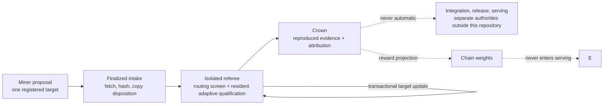

# Architecture overview

At the highest level, Cacheon is two systems joined by a controlled promotion
boundary. The market system deliberately separates its subnet control plane
from its hostile-code referee, so operators interact with three surfaces:

- **Cacheon Engine** is a chain-independent inference-acceleration distribution built on a pinned SGLang substrate.
- **The subnet** owns finalized proposal ordering, attribution, settlement, and weight publication.
- **The referee** screens and measures hostile proposals against validator-owned policy and evidence authority.

The referee may execute hostile miner artifacts. The engine never serves them
directly. A measured win becomes a **crown**; a crown becomes shippable only
after review, integration that preserves the crowned selected payload,
deterministic packaging outside that selected closure, and release signing.

This split is the primary architectural constraint. It prevents economic state, mutable miner hosting, and unreviewed proposal code from becoming production dependencies.

## The core boundaries

Cacheon uses two different units on purpose.

| Boundary | Unit | Why it exists |
|---|---|---|
| Execution | A complete isolated engine | Candidate Python, native code, engine construction, and serving behavior remain outside the trusted controller. |
| Attribution | One registered slot or atomic target | A miner proposes only the smallest attributable delta; the validator supplies the incumbent stack around it. |

A candidate can therefore improve an incumbent stack without receiving or repackaging the incumbent contributors' bundles. For example, a new 3% delta can be tested on top of an existing 7% improvement while attribution remains attached only to the new delta.

Execution isolation does not imply whole-engine economic ownership. Conversely, narrow economic identity does not require importing candidate code into the controller.

## Architectural objects

Two objects must remain distinct throughout the system:

1. A **proposal** is hostile input: a target-scoped delta.
2. A **crown** is retained evidence that the proposal improved one registered arena and target.

Integration into maintained source, release, and serving are separate authorities that this repository does not implement. A crown never ships by itself.

See [Product model](product-model.md) for the authority and lifecycle of each object.

## System map

| Area | Responsibility | Principal implementation |
|---|---|---|
| Submission ABI | Stable typed replacement boundaries and validator-owned correctness contracts | [`slots.py`](https://github.com/latent-to/cacheon/blob/main/cacheon/slots.py), [`tensor_spec.py`](https://github.com/latent-to/cacheon/blob/main/cacheon/tensor_spec.py) |
| Economic identity | Registered singleton and atomic targets, displacement, and conflict policy | [`target_catalog.py`](https://github.com/latent-to/cacheon/blob/main/cacheon/target_catalog.py) |
| Runtime integration | Version-pinned SGLang chokepoints, bootstrap, dispatch, and execution evidence | [`seams.py`](https://github.com/latent-to/cacheon/blob/main/cacheon/seams.py), [`seam.py`](https://github.com/latent-to/cacheon/blob/main/cacheon/seam.py), [`dispatch.py`](https://github.com/latent-to/cacheon/blob/main/cacheon/dispatch.py) |
| Stack identity | Content-addressed evaluation manifests, exact marginal substitutions, rollback | [`stack_manifest.py`](https://github.com/latent-to/cacheon/blob/main/cacheon/stack_manifest.py), [`stack_plan.py`](https://github.com/latent-to/cacheon/blob/main/cacheon/stack_plan.py) |
| Engine construction | Deterministic source closure, namespacing, native build identity, isolated OCI execution | [`engine_tree.py`](https://github.com/latent-to/cacheon/blob/main/cacheon/engine_tree.py), [`eval/engine_launch.py`](https://github.com/latent-to/cacheon/blob/main/cacheon/eval/engine_launch.py), [`eval/oci_backend.py`](https://github.com/latent-to/cacheon/blob/main/cacheon/eval/oci_backend.py) |
| Qualification | Registered routing-only resident screen; v7 resident B/C with conditional B′ or v8 two-process B/C/B′; eager audit; pristine T; retained evidence | [`arena_service.py`](https://github.com/latent-to/cacheon/blob/main/cacheon/arena_service.py), [`eval/resident_screen_lane.py`](https://github.com/latent-to/cacheon/blob/main/cacheon/eval/resident_screen_lane.py), [`eval/resident_pair_crossover.py`](https://github.com/latent-to/cacheon/blob/main/cacheon/eval/resident_pair_crossover.py), [`eval/crossover_runtime.py`](https://github.com/latent-to/cacheon/blob/main/cacheon/eval/crossover_runtime.py), [`eval/qualification_runner.py`](https://github.com/latent-to/cacheon/blob/main/cacheon/eval/qualification_runner.py) |
| Chain authority | Finalized ordering, immutable publication, state transitions, settlement, legacy V1 projection, and publication journals | [`chain/intake.py`](https://github.com/latent-to/cacheon/blob/main/cacheon/chain/intake.py), [`settlement.py`](https://github.com/latent-to/cacheon/blob/main/cacheon/settlement.py), [`chain/weights.py`](https://github.com/latent-to/cacheon/blob/main/cacheon/chain/weights.py) |
| Model provisioning | Model sealing and provisioning receipts | [`model_provision.py`](https://github.com/latent-to/cacheon/blob/main/cacheon/model_provision.py) |

## Trust model

The validator owns policy, identities, workloads, timing, references, output buffers, storage, and state transitions. Candidate code is never trusted to grade itself.

The production referee follows these rules:

- the controller never imports candidate Python or native extensions;
- every timed arm runs as a complete engine in a disposable, no-egress OCI session;
- the candidate engine cannot choose its incumbent, role, workload, target identity, or evidence schema;
- B and C, plus the policy-required B′, are timed under a sealed lane
  authority; current v7 makes B′ conditional and current v8 precommits it;
- any required sampled audit runs in a separate eager, untimed candidate role
  and is regraded by the trusted host;
- T is pristine, candidate-free, untimed, and used only for semantic quality;
- infrastructure failure or cohort drift produces `NO_DECISION`, not a loss or crown;
- settlement reopens retained evidence and requires two independent passing authorities.

The slot boundary adds a second layer of defense: the validator allocates the output and keeps every slot strictly upstream of sampling. See [Slot contract](slot-contract.md).

## Stack model

The referee and the semantic reference use separate manifests:

- `EvaluationStackManifest` may name hostile crowned proposal artifacts and is valid only inside isolated evaluation.
- `ReferenceManifest` names pristine validator-owned semantic authority used for untimed quality grading.

All identities are canonical and content-addressed. A candidate arm is the incumbent evaluation stack with one registered target transition. A crown updates the evaluation stack transactionally and nothing else. See [Stacks and manifests](stacks.md).

## Data plane scope

Normal submissions optimize the inference data plane: kernels, quantized GEMMs, attention, MoE, collectives, communication overlap, KV-cache operations, graphs, fused blocks, and bounded execution-adjacent strategies.

The service control plane remains upstream of the competition boundary: HTTP and API behavior, authentication, tokenization, request admission, fleet orchestration, autoscaling, observability, and operational lifecycle management are not ordinary miner targets.

Work that cannot fit a registered target is not a valid submission. Widening the
catalog — a new slot or atomic target — is a reviewed validator-side change,
followed by fresh qualification and CROWN linkage; there is no separate proposal
lane. (A fenced "discovery lane" for cross-cutting source patches existed until
2026-08-19 and was removed without ever admitting a production proposal.)

## End-to-end flow

The authoritative path is:

1. finalized timelock commit-reveal intake;
2. hardened fetch, content re-hash, copy disposition, and immutable worker publication;
3. registered-arena static, build, ABI, graph, abbreviated-serving, and optional
   routing-only resident screens;
4. sealed resident adaptive speed qualification, registered eager audit, and
   pristine T quality;
5. independent reproduction of the exact candidate identity with the required
   physical-lane role swap;
6. evidence reopening, conservative settlement, and transactional stack update;
7. journaled reward projection and weight publication.

`scan` and `verify` are contributor diagnostics. Matched A/B profiling on
contributor-controlled hardware may test a performance mechanism, but none of these paths
can mint production crown authority. See [Evaluation pipeline](pipeline.md) for the
detailed state machine.

## Design acceptance tests

The architecture is preserving its product boundary when all of the following remain true:

- the latest signed engine can be rebuilt and served without chain access or miner hosting;
- every candidate is measured as one marginal substitution over the current stack;
- candidate code stays outside the trusted controller;
- a whole-system prototype cannot silently acquire a permanent whole-engine reward title;
- every shipped component resolves to reviewed Cacheon source and immutable attribution;
- changing the evaluation incumbent cannot mutate a signed release;
- shipping a reviewed release does not depend on chain availability.

## Further reading

- [Product model](product-model.md)
- [Stacks and manifests](stacks.md)
- [Evaluation pipeline](pipeline.md)
- [SGLang seam](seam.md)
- [Current state of record](../reference/state-of-record.md)
- [Normative product model](product-model.md)
