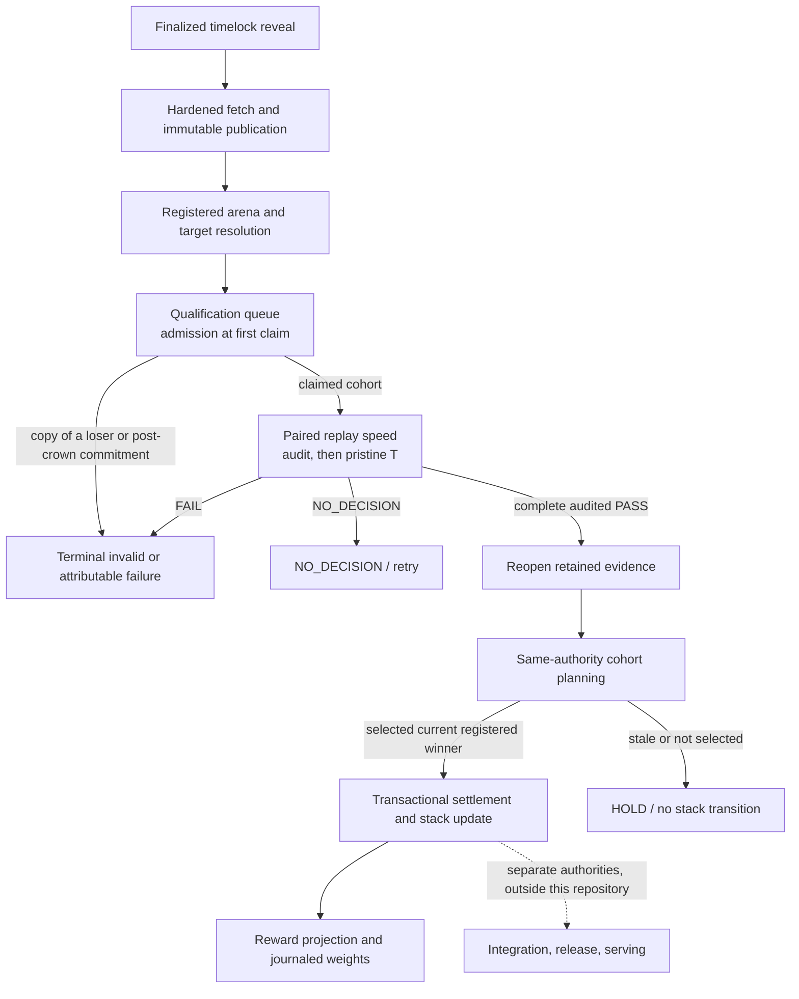

# Evaluation pipeline

Cacheon has two evaluation paths with different authority:

- the **developer path** helps a miner build and debug a proposal;
- the **production referee path** can create retained qualification, crown, settlement, and reward state.

The developer commands intentionally reuse parts of the ABI and evaluation machinery, but their output is not production crown evidence.

## Developer path

```text
scan -> verify -> check -> chain-package -> host -> chain-submit -> chain-status
```

| Step | Purpose | Authority |
|---|---|---|
| `scan` | Run static bundle policy checks | Diagnostic |
| `verify` | Resolve the target, import each entry, and check its signature | Diagnostic |
| `check` | Audit against stock and captured execution in the published arena image | Diagnostic |
| `chain-package` | Produce the deterministic hosted archive and content identity | Submission preparation |
| HTTPS host | Make the immutable archive available for validator fetch | Transport only |
| `chain-submit` | Commit the proposal through timelock commit-reveal; optional eval-cost `--pay` | Chain intake |
| `chain-status` | Inspect submission state | Informational |

Local measurements are useful for iteration. They do not select a production arena
authority, reserve a finalized cohort position, retain authenticated resident
speed evidence under the sealed paired replay, perform
the registered eager audit A and pristine-reference T stages, or authorize settlement.

## Production path at a glance



## 1. Finalized intake

Submissions enter through native timelock commit-reveal. The validator acts only on finalized chain order. Finalized block position and commitment identity establish priority; evaluator network arrival does not.

`FinalizedIntakeStore` persists production authority in SQLite. It records finalized observations, fetch state, copy disposition, cohort reservations, qualification attempts, evidence roots, reproduction state, stack transitions, settlement, and weight-publication state.

State transitions are typed and transactional. The validator does not reconstruct production authority from console output, mutable directories, or a legacy JSON ledger.

Principal code: [`chain/intake.py`](https://github.com/latent-to/cacheon/blob/main/cacheon/chain/intake.py) and [`chain/validator_loop.py`](https://github.com/latent-to/cacheon/blob/main/cacheon/chain/validator_loop.py).

## 2. Hardened fetch and publication

The submitted URL is transport, not identity. The fetch path:

1. applies the validator's HTTPS and network policy;
2. writes into validator-private bounded storage;
3. recomputes the deterministic bundle content hash;
4. compares it with committed identity;
5. derives the copy/provenance disposition;
6. publishes the complete artifact into an immutable, hash-addressed worker namespace;
7. reopens the publication before any qualification launch consumes it.

Partial downloads, path tricks, changed content, duplicate/malformed archives, and publication mismatches fail closed. Candidate workers receive only immutable publications; they do not fetch miner URLs themselves.

Principal code: [`chain/fetch.py`](https://github.com/latent-to/cacheon/blob/main/cacheon/chain/fetch.py), [`chain/payload.py`](https://github.com/latent-to/cacheon/blob/main/cacheon/chain/payload.py), and [`bundle_hash.py`](https://github.com/latent-to/cacheon/blob/main/cacheon/bundle_hash.py).

## 3. Arena and target resolution

An `ArenaServiceRegistry` maps a public arena identifier to a closed
`ArenaService`. Its manifest directly binds:

- runtime, base-engine, validator-overlay, worker, model, architecture, GPU,
  and topology identities;
- the scored workload cells and prompt-seed scheme;
- queue depth and age, active-qualification concurrency, and cohort size;
- the qualification-policy digest; and
- the reviewed provider implementation digest.

The target catalog, incumbent and candidate stacks, graph/engine settings,
calibration, reference, evidence, and quality identities are closed later by
the claimed candidate bindings and the provider-created typed qualification
plan. `ArenaService` checks the plan's policy digest and finalized reservation
order; it does not pretend all of that authority is a field of the service
manifest itself.

The proposal is resolved against the exact target catalog snapshot. A registered candidate must match its target members and permitted features; unregistered work fails resolution.

The command-line `chain-validate` loop can perform intake alone. Full production qualification requires the operator to inject a real `ArenaServiceRegistry` and select `--arena-id`; the repository does not manufacture a production arena provider from implicit defaults.

Principal code: [`arena_service.py`](https://github.com/latent-to/cacheon/blob/main/cacheon/arena_service.py), [`target_catalog.py`](https://github.com/latent-to/cacheon/blob/main/cacheon/target_catalog.py), and [`stack_plan.py`](https://github.com/latent-to/cacheon/blob/main/cacheon/stack_plan.py).

## 4. Qualification queue and admission

There is no separate screening stage. A published reservation waits in the arena's
qualification queue in finalized order. The arena's registered capacity bounds the
work instead: queue depth and age, active qualifications, and cohort size.

Admission runs when a queued row is first claimed, before any lease exists:

- an exact copy of bytes that already lost under this arena inherits that `FAIL`; a
  `PASS` is never replayed;
- a reservation for a target the commissioned arena cannot measure is released as
  target-unavailable without a verdict; and
- a commitment after the first crown on the commissioned baseline is rejected as
  `baseline_closed_at_submission`.

The first claim stamps the arena service identity the row is measured under, and a row
claimed once never meets a second admission cutoff. Infrastructure errors release the
lease without consuming a qualification attempt; three consecutive infrastructure
releases hold the row instead of converting it into a loss.

Principal code: [`chain/arena_state.py`](https://github.com/latent-to/cacheon/blob/main/cacheon/chain/arena_state.py),
[`chain/duplicate_replay.py`](https://github.com/latent-to/cacheon/blob/main/cacheon/chain/duplicate_replay.py),
and [`chain/evaluation_lease_store.py`](https://github.com/latent-to/cacheon/blob/main/cacheon/chain/evaluation_lease_store.py).

## 5. Cohort authority

At an evaluation boundary, the validator freezes:

- one incumbent `EvaluationStackManifest` digest;
- a finalized chain-ordered set of candidate reservations;
- one registered arena and target-catalog context;
- deterministic candidate order derived from committed authority;
- workload, prompt, seed, role, topology, calibration, and evidence policy.

Each candidate stack is the frozen incumbent with exactly one registered target delta.
Production qualification uses two isolated TP lanes while serializing GPU work. One
attempt runs both lane orientations: the incumbent on lane B and the candidate on lane
A, then fresh engines with the roles exchanged. The swap is part of the sealed speed
policy, not a scheduler preference.

Qualification constructs a fresh, candidate-specific authority and retains each speed,
audit, graph, and T product against that exact delta.

Principal code: [`eval/qualification_intake.py`](https://github.com/latent-to/cacheon/blob/main/cacheon/eval/qualification_intake.py) and [`stack_plan.py`](https://github.com/latent-to/cacheon/blob/main/cacheon/stack_plan.py).

## 6. Version-3 adaptive qualification

The production evidence protocol is version 3. Inside it, every candidate is
measured by the paired replay: the plan seals speed policy 17, and separate
incumbent and candidate processes replay the same sealed agent workload
concurrently on two isolated lanes, then boot fresh with the lanes exchanged.
Speed policy 16 is regrade-only, and evidence sealed below version 16 is
refused.

The current subpolicy retains stage and total budgets and the required
physical-lane role assignment. Evidence reopens under the arithmetic that
produced it; a label change cannot upgrade it and pre-v16 witnesses are refused.

The authoritative work is staged. Speed is decided first; audit and pristine-reference
quality run only after the speed stage remains eligible, apart from an explicitly
registered calibration-observation continuation.

| Arm | Stack | Timed? | Purpose |
|---|---|---:|---|
| B | Exact frozen incumbent on the assigned baseline lane/process | Yes | Incumbent replay; after a speed PASS, the selected stock-drift controls |
| C | Incumbent plus one exact target delta on the disjoint candidate lane/process | Yes | Candidate replay and sealed trajectory |
| A | Candidate in a separate eager, untimed role | No | Registered sampled slot audit and typed host regrade |
| T | Pristine candidate-free reference | No | Teacher-forced semantic quality and hidden tasks |

Native build and timed execution use separate containers. Before a runtime arm
starts, a disposable, no-GPU/no-network prebuild OCI parses the materialized
tree, invokes only registered build patchers, and emits a sealed native
publication. The resident speed lanes mount that reopened
publication read-only. Candidate Python import, engine construction, and
execution occur only in the runtime's positively identified scheduler ranks;
runtime ranks may validate and load native products but may never compile or
repair them. Both stages use read-only roots, bounded mounts and protocols, and
host-owned cleanup; the trusted controller also owns timing.

The sealed stopping rule, not the candidate, decides how many paired windows
run, and the regrade checks that the retained windows stopped exactly where the
rule stops. Both engines condition and flush before each window, and every
window is retained. The last sealed window yields PASS or FAIL; a sealed futility
margin may FAIL the stage after the first orientation. Invalid baseline evidence
cannot produce a candidate verdict.

When the registered plan requires sampled slot audit, a separate eager, untimed candidate
role emits bounded raw facts. The trusted host grades exact slot × TP-rank/process coverage
through a Torch-free gate and canonicalizes floating-point facts before durable receipt
identity is computed. These facts cannot enter the charged speed roles. A slot or target
without a registered audit requirement cannot acquire audit authority from an incidental
diagnostic receipt.

After the candidate speed and audit lifetimes are destroyed, T grades the sealed
trajectory under a separate pristine lifetime. T never contains the candidate and does
not compete on speed. Hidden reference work, quality policy, and selected prompt identity
are bound into retained evidence.

The host applies the exact versioned policy. Conceptually, a policy-17 result
pools elapsed serving cost within each lane orientation:

```text
speedup  = exp(mean over orientations of log(pooled B cost / pooled C cost))
eligible = one-sided lower bound on speedup > 1 at a sealed look
```

The exact registered policy, not this explanatory formula, is authoritative.

Principal code: [`eval/crossover_runtime.py`](https://github.com/latent-to/cacheon/blob/main/cacheon/eval/crossover_runtime.py),
[`eval/qualification.py`](https://github.com/latent-to/cacheon/blob/main/cacheon/eval/qualification.py),
[`eval/qualification_runner.py`](https://github.com/latent-to/cacheon/blob/main/cacheon/eval/qualification_runner.py),
and [`audit_gate.py`](https://github.com/latent-to/cacheon/blob/main/cacheon/audit_gate.py).

## 7. Verdict semantics

Qualification has three outcomes:

### `PASS`

The candidate clears the registered speed, quality, graph, evidence, and whole-stack requirements under a stable cohort authority. One complete audited pass becomes `qualified` and is eligible for settlement.

### `FAIL`

Complete evidence attributes a policy failure to the candidate under a valid authority. Examples include incorrect output, a quality regression, or a speed gain not established by the last sealed window.

### `NO_DECISION`

The evaluator cannot make a valid attributable decision. Infrastructure failure, missing evidence, broken cohort invariants, or an invalid reference lifetime must not mint either a crown or a loss. The result retains a failure product and retry policy.

The distinction is load-bearing: treating evaluator failure as candidate failure would let infrastructure state rewrite economic truth.

### Worked lifecycle: qualify and settle

Intake freezes one contribution and its finalized priority. Its first claim
admits it to a complete paired-replay qualification with eager audit and pristine T.
One complete audited PASS becomes `qualified`. Settlement reopens
that attempt's retained evidence and atomically records its result before the
next ordinary intake continues. Incomplete evidence remains `NO_DECISION` and
cannot create a miner loss or reward.

## 8. Qualification acceptance

A single complete audited PASS supplies `SettlementCandidate`. Its contribution
identity binds the arena, target, delta, hotkey, and incumbent/candidate stack
and tree digests. There is no automatic second qualification. Historical pairs
retain their original distinct-authority, physical-lane-swap, and lower-score
checks when reopened.

## 9. Settlement

Settlement reopens every accepted attempt reference instead of trusting an in-memory
verdict. The references may live under the same content-addressed store root. It verifies:

- the report is a complete audited `PASS`;
- the retained authority, attempt, report, and selection identities match the candidate;
- the measured baseline belongs to the active target lineage and an ancestor-based
  result beats the composed improvement to the current tip;
- target displacement, conflicts, and requirements remain valid;
- the requested stack update matches the measured candidate.

The submission cutoff is enforced during admission before the first qualification claim:
commitments after the first crown on that commissioned baseline are rejected as
`baseline_closed_at_submission`. Commitments in the finalized crown block or earlier
can drain, including delayed fetches. A new commission has its own admission window.
Settlement never repeats this arrival-time check.

The planner leases one cohort whose rows share qualification authority and incumbent
state. Incomparable or insufficient ancestor results are held, and one registered winner is selected across
the remaining rows, including rows whose targets do not overlap. Other current pairs are
held as `conflict_lost` or `incumbent_advanced`. An ancestor result that does not
beat the champion receives `lost_potential`; an incomparable baseline retains
`stale_incumbent`. The dashboard also reports `lost_potential` for finalized
reward comparisons that do not clear the margin, preserving the original PASS.

For the selected winner, the settled speedup is the accepted qualification's speedup
(the lower of the two for a historical pair). The stack transition and settlement evidence are committed
transactionally; a partial write cannot expose a half-updated incumbent.

Principal code: [`settlement.py`](https://github.com/latent-to/cacheon/blob/main/cacheon/settlement.py).

## 10. Incentive state and weight publication

Settlement and weight publication are separate state machines. The repository retains two
explicitly fenced incentive paths:

- **Legacy V1** projects active standing and discovery claims through `set-weights`. During
  an all-uncrowned bootstrap, an operator may provide a registered burn hotkey; the burn
  projection becomes invalid as soon as a crown, claim, or active V2 composition exists.
  `--watch` operates the same journaled reconciler continuously with bounded retry rules.
- **V2 finite debt** is a retained design whose implementation is not in the tree; see
  [Finite-debt V2](../reference/emissions-policy.md#finite-debt-v2).

A qualified PASS is paid only when it beats the best earlier rewarded PASS against the
same arena and incumbent stack by the reward margin (1.5% for V17).

The publisher persists intent and later readback states. An SDK return value does not
prove inclusion, and the publisher may not advance economic authority from an
unconfirmed vector.

Principal code: [`chain/weights.py`](https://github.com/latent-to/cacheon/blob/main/cacheon/chain/weights.py).
See the [emissions policy](../reference/emissions-policy.md).

## 11. Integration

A settled crown changes the evaluation stack and nothing else. Integration into maintained source, release, and serving are separate authorities that this repository does not implement; see [After a crown](../engine/integration.md).

## Operational handoff checklist

Before treating an attempt as production authority, an operator or reviewer should be
able to reopen, rather than merely observe, each handoff:

- finalized chain position, commitment, fetched content identity, and immutable worker
  publication;
- registered arena, target catalog, incumbent manifest, candidate transition, and
  candidate binding (reservation, publication, and qualification attempt);
- lane identities and a versioned `ResidentSpeedWitness` containing every paired
  window's turn records, plus
  retained graph/quality/pristine-T references and witnesses; richer raw
  session/device frames are validated in-run but are not serialized into the
  attempt;
- frozen calibration and the exact policy that maps the retained witness/evidence products
  to the verdict;
- for a historical pair only, the seven digest-distinctness fields across primary and
  reproduction over one reproduction identity;
- transactional settlement events and resulting evaluation-stack digest;
- reward projection plus publication intent/status/chronology records; later readback
  vectors must be re-observed because the journal does not serialize them; and
- if shipping is proposed, the separate integration and release records kept outside
  this repository.

Console output, a green local benchmark, one `PASS`, or a successful chain SDK return is
not a substitute for the corresponding reopenable product.
