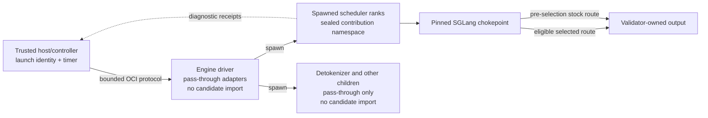

# SGLang seam

The seam connects Cacheon's stable slot ABI to version-pinned SGLang internals. It is intentionally split into two layers:

- [`slots.py`](https://github.com/latent-to/cacheon/blob/main/cacheon/slots.py) defines the stable miner-facing semantic contract;
- [`seams.py`](https://github.com/latent-to/cacheon/blob/main/cacheon/seams.py) defines the SGLang-specific adapter registry that must be reviewed whenever the runtime pin moves;
- [`seam.py`](https://github.com/latent-to/cacheon/blob/main/cacheon/seam.py) and the [`scheduler_gate` adapter](https://github.com/latent-to/cacheon/blob/main/cacheon/integrations/sglang_scheduler_gate.py) enforce activation and scheduler-only candidate loading.

Slots are the narrow waist. Adapters are replaceable glue.

## Why the seam exists

SGLang constructs the model in spawned scheduler processes. Patching a class in the parent process does not reliably reach those children, and importing candidate code into the parent would put the host timer inside the candidate's trust domain.

Cacheon therefore installs a small pass-through seam in every relevant interpreter and activates candidate implementations only inside the engine worker's scheduler ranks. The host controller and timing process never import contribution modules.



## One adapter table

`SEAM_ADAPTERS` is the single source of truth for:

- modules watched by the startup bootstrap;
- integration modules installed by `seam.activate()`;
- compatibility canaries run against the pinned SGLang revision;
- public binding identifiers and their fixed environment gates.

Adding an adapter is one table change plus its implementation and tests. Bootstrap, activation, and compatibility derive their vocabulary from that table rather than maintaining parallel lists.

The registered rows are:

| Adapter | SGLang chokepoint | Role |
|---|---|---|
| `scheduler_gate` | `run_scheduler_process` | Positive scheduler-role candidate-load gate; not a slot |
| `resident_swap` | `ModelRunner.init_decode_cuda_graph` plus idle-gated scheduler cache flush | Persistent resident screening only; not qualification or a slot |
| `nodes` | `ModelRunner.load_model` | Every registered [node address](slot-contract.md#node-addresses); binds the named modules of the served model once the weights are loaded |

`nodes` is the only adapter that serves candidate code. It patches no SGLang
method: it replaces the `forward` of the modules a bundle named, so a model whose
layers take a different class (`GemmaRMSNorm` instead of `RMSNorm`) is reached by
the same row. The per-operation adapters it replaced each pinned one SGLang
method and had to be re-derived for every model family and engine bump.

`resident_swap` is deliberately outside the crown path. It is inert unless the
validator supplies `CACHEON_RESIDENT_SWAP` to a persistent screening engine. The
host stages a strictly increasing swap generation, triggers an idle-gated
recapture, and requires an acknowledgement from every scheduler rank. A failed
swap clears and disables the registry so the screen cannot measure a
half-installed contribution. Qualification launches never set this control
directory and never inherit screen evidence.

## Bootstrap across spawned processes

The primary installation path places `import cacheon.bootstrap` in a Python `.pth` file. Python executes the import at interpreter startup, including in spawned scheduler children.

The bootstrap remains import-light. It does not eagerly import Torch or SGLang.
Instead it installs a meta-path finder over the target modules derived from
`SEAM_ADAPTERS`. When one of those modules loads, the finder wraps its loader
and invokes `seam.activate()` after the original module body completes.

Activation is idempotent, but its name should not be read as “load the
candidate.” It installs whatever pass-through adapters are now available and
arms an eligible worker, then leaves the registry disabled. Candidate code is
loaded only when the `scheduler_gate` wrapper positively observes entry into
`run_scheduler_process` and calls `seam.load_candidate_bundle()`. This matters
because SGLang's detokenizer and other children also import watched modules;
import-triggered candidate loading there would put miner module code in the
output path downstream of sampling.

Each integration's `install()` function no-ops until its target module is
present and refuses duplicate patching. Repeated activation therefore installs
newly available adapters without stacking wrappers, while non-scheduler
children stay pass-through and never emit an `active` receipt.

SGLang versions that expose a plugin framework also have an [`sglang_plugin.py`](https://github.com/latent-to/cacheon/blob/main/cacheon/integrations/sglang_plugin.py) shim. The `.pth` bootstrap remains the general spawn-safe path across the supported pin.

Principal code: [`bootstrap.py`](https://github.com/latent-to/cacheon/blob/main/cacheon/bootstrap.py),
[`seam.py`](https://github.com/latent-to/cacheon/blob/main/cacheon/seam.py), and
[`sglang_scheduler_gate.py`](https://github.com/latent-to/cacheon/blob/main/cacheon/integrations/sglang_scheduler_gate.py).

## Closed activation vocabulary

The controller does not send arbitrary environment variable names across the worker protocol. It selects a sorted, duplicate-free set of public binding identifiers from the closed `SEAM_BINDINGS` vocabulary.

Inside the engine, each binding maps to one fixed gate. No current adapter row
declares a binding, so the vocabulary is empty and every session carries an empty
binding set; the node adapter is armed by the registered bundle alone.

Normalization rejects unknown, duplicated, or non-canonical identifiers. Engine launch then emits the complete fixed seam environment, preventing stale ambient values from arming additional adapters.

The exact binding set is derived from the materialized stack and retained in launch identity. B and B′ use the same incumbent binding set. C differs only as required by its selected target delta. The pristine T reference has no candidate seam activation.

## Sealed contribution namespaces

The hardened path does not add an arbitrary miner directory to `PYTHONPATH`. `engine_tree.py` inspects contribution closure and emits each contribution under a deterministic namespace of the form `cacheon_c_<sha256>`.

At startup, `seam.py` exposes those namespaces only if all worker bindings agree:

- the process is explicitly marked as an engine worker;
- the bundle path is the fixed `/cacheon/engine-tree` mount;
- engine-tree and stack digests are canonical SHA-256 values;
- the mount is a concrete directory at its fixed path;
- for signed serving, the verified release descriptor digest matches the required digest.

The namespace finder resolves only sealed generated namespaces from that root. It does not make the rest of the mounted tree an unrestricted import location.

## Driver and scheduler roles

The engine driver is marked before SGLang import. Activation installs
pass-through dispatchers there but disables the registry and never loads
contribution code. This keeps wall-clock timing outside candidate control.

Spawned children also begin pass-through. Only a process entering the wrapped
`run_scheduler_process` is allowed to call `load_candidate_bundle()`. That
scheduler rank independently reopens the sealed engine tree, validates only
prebuilt/reviewed native products, loads contribution modules into generated
namespaces, registers eligible implementations, retries registry-dependent
adapter installation, and enables the registry. Detokenizers and other manager
children never cross this load gate. For signed serving, missing namespace,
activation, scheduler-gate installation, or required seam installation
terminates startup.

This separation is essential:

```text
driver/timer: adapters installed, registry disabled, no candidate import
other child:  adapters may install, registry disabled, no candidate import
scheduler:    positive process entry, sealed contribution loaded, registry enabled
```

### Trace one serving call

For a signed release, one successful candidate-backed call crosses the seam in this order:

1. The container entry point verifies the release, model, native artifacts, signed command,
   and required binding set before starting SGLang.
2. The startup bootstrap arms import hooks in each spawned interpreter without importing a
   contribution.
3. Spawned interpreters import watched SGLang modules. Original modules load first, then
   their pass-through adapters install once; this still does not import candidate code.
4. Only a scheduler rank enters wrapped `run_scheduler_process`. At that positive role
   boundary it calls `load_candidate_bundle()`, reopens `/cacheon/engine-tree`, verifies
   the expected tree/stack/release identities, and exposes only its sealed
   `cacheon_c_<sha256>` namespaces. Detokenizer/output-path children never do this.
5. Once the weights are loaded, the node adapter replaces the `forward` of every module a
   registered bundle named.
6. On each call the dispatcher builds a descriptor from the live tensors, resolves an
   eligible registered variant, and invokes the contribution with the module's own
   arguments.
7. The rank emits `completed` receipts for the selected slot.

If step 6 finds no eligible candidate, stock routing before selection can be legitimate.
If the candidate fails after selection, the error takes the run down: it is never
reinterpreted as a successful candidate execution or served by stock.

## Dispatch contract

The node dispatcher:

1. serves stock while Dynamo is tracing, while FlashInfer is profiling tactics, while
   another candidate is already running, or while the registry is disabled;
2. derives a call descriptor (dtype, width, token count, architecture, graph mode) from
   the live call and resolves a variant against validator-owned eligibility;
3. runs `prepare(module)` once per bound node;
4. on a sampled eager call, takes the stock answer and the honest twin's answer first and
   puts the arguments and engine state back (see
   [node addresses](slot-contract.md#node-addresses));
5. invokes the candidate with the module's own arguments and returns its result to SGLang.

Before candidate selection, ineligibility is normal stock routing. During crownable qualification, selected-path failures and fallbacks invalidate evidence; they must not silently become stock-vs-stock success.

The dispatcher is [`sglang_nodes.py`](https://github.com/latent-to/cacheon/blob/main/cacheon/integrations/sglang_nodes.py); registration and eligibility live in [`registry.py`](https://github.com/latent-to/cacheon/blob/main/cacheon/registry.py).

## Graph behavior

Binding happens before SGLang captures its prefill and decode graphs, so a bound node is captured at every width. Audited comparisons run on eager calls only; the timed graphs-on run records whether each candidate call happened inside a capture.

An adapter that fires only in eager mode, captures a cached answer, mutates storage identity, or bypasses live replay is not qualified for a graphs-on arena. See [Slot contract](slot-contract.md) and [Graph safety](../miner-guide/graph-safety.md).

## Receipts and authority

Scheduler ranks can write process-local seam receipts:

- `active` — the sealed tree loaded and registered slots;
- `load_failed` — activation failed or registered nothing;
- `not_selected` — a candidate is registered for this slot but the routing
  decision sent the call to stock, with the field-level reason;
- `completed` — the candidate produced the model-facing output.

A `completed` receipt carries two further fields:

- `calls` — how many times the candidate entry was invoked under this scope;
- `captured` — whether at least one of those invocations happened while a CUDA
  graph was capturing.

`captured` is the load-bearing one. Scored windows replay a captured graph and do
not re-enter Python. A candidate absent from the captured graph serves stock on
every replay, while its `completed` receipt is already on disk from eager warmup
minutes earlier. `captured: false` with
`calls > 0` is exactly that shape and must not be read as candidate execution.
Both fields are reported only when every rank carries them, and `captured` is
true only when every rank agrees — one rank serving stock makes the measurement
stock.

A `not_selected` receipt carries one entry per DISTINCT routing reason, never one
per call: `outcome` (`out_of_domain` or `ambiguous`), the `fields` that declined,
and the expected domain for each. It is written from
`KernelRegistry.select`, so it covers every dispatcher without any of them having
to remember to report.

It exists because "registered but never ran" used to be one shape on disk
covering three unrelated causes — the declared domain never matched a live call,
the seam never fired, or the entry was never reached — and each needs a different
fix. With it, the ladder answers the question directly.

These receipts are valuable positive accounting. They catch phantom passes where a benchmark accidentally measures stock code. They are also used by the signed-release serve smoke to require active/completed coverage.

`fired` was retired on 2026-08-23. It recorded that the registry *resolved* an
implementation, which is weaker than it reads — the caller could still decline
afterwards — so every production call site opted out of the write and a
probe-only duplicate of `lookup` existed solely to avoid it. Once an entry is
invoked there are exactly two outcomes, `completed` or `fallback`, and either one
proves selection.

The active-member gate expects exactly the registered tensor-parallel scheduler
ranks. Too few receipts means a scheduler did not activate; an extra receipt
means candidate code crossed into an unexpected process role. Either condition
invalidates coverage rather than being rounded away.

They are **not standalone crown authority**. Production qualification authority comes from the host-owned OCI lifecycle, bounded authenticated session protocol, device-state evidence, sealed role schedule, host timing, pristine T evidence, and reopened evidence products. A candidate process cannot crown itself by writing a plausible receipt file.

See [`receipts.py`](https://github.com/latent-to/cacheon/blob/main/cacheon/receipts.py), [`eval/oci_session_protocol.py`](https://github.com/latent-to/cacheon/blob/main/cacheon/eval/oci_session_protocol.py), and [`eval/qualification_runner.py`](https://github.com/latent-to/cacheon/blob/main/cacheon/eval/qualification_runner.py).

## Compatibility and upgrades

The seam is deliberately pinned-runtime code. An SGLang upgrade requires:

1. updating the explicit runtime pin and vendor provenance;
2. running the compatibility canary over every assessable adapter row;
3. reviewing changed chokepoints and call descriptors;
4. rerunning slot, graph, collective, engine, and failure-path tests;
5. recalibrating affected arena noise and quality profiles;
6. producing new runtime, engine-tree, native, and release identities.

Optional backend rows declare `requires` packages so CPU/dev environments can skip an unassessable adapter rather than report a false break. Production arenas that depend on that adapter must provide and assess the dependency.

!!! warning "Pin-validation boundary"
    A green import/chokepoint canary is necessary compatibility evidence, not proof that
    a pin preserves candidate execution and measured performance. See
    [SGLang compatibility](../dev/sglang-tracking.md) for the complete validation ladder.

### Diagnosing a seam failure

Read receipts in lifecycle order instead of treating any single file as success:

| Last trustworthy observation | Likely boundary | What to inspect |
|---|---|---|
| No `active` receipt | Bootstrap, watched import, sealed namespace, or registration | Pin, adapter canary, worker role, tree/release digests, scheduler logs |
| `active`, `not_selected` present | The declared domain never matched a live call | The receipt names the field and the expected domain; compare against the sealed workload |
| `active`, no `not_selected`, no `completed` | The chokepoint never fired, or the entry was never reached | Adapter firing, seam env, topology, deadline, exception, rank agreement, device state |
| `completed` with `captured: false` | Candidate never entered the captured graph; scored replays served stock | Whether the seam was reached during capture, and graph metadata against the captured shapes |
| Full per-rank coverage, quality/speed fails | Seam worked; the contribution did not qualify | Qualification evidence and pristine T report, not bootstrap code |

A common diagnostic mistake is to stop at “the server answered.” Stock fallback can keep
a server responsive. Authority requires the expected slot-by-rank `active`/
`completed` coverage and the absence of `load_failed` or `fallback`, followed by the
separate quality and performance gates.

## Source map

- [`seams.py`](https://github.com/latent-to/cacheon/blob/main/cacheon/seams.py) — adapter and binding source of truth
- [`bootstrap.py`](https://github.com/latent-to/cacheon/blob/main/cacheon/bootstrap.py) — startup/import hook
- [`seam.py`](https://github.com/latent-to/cacheon/blob/main/cacheon/seam.py) — activation and sealed contribution loading
- [`dispatch.py`](https://github.com/latent-to/cacheon/blob/main/cacheon/dispatch.py) — capture, tracing and tuning probes the dispatcher reads
- [`integrations/sglang_nodes.py`](https://github.com/latent-to/cacheon/blob/main/cacheon/integrations/sglang_nodes.py) — the node dispatcher
- [`integrations/`](https://github.com/latent-to/cacheon/tree/main/cacheon/integrations) — version-pinned SGLang adapters
- [`integrations/sglang_resident_swap.py`](https://github.com/latent-to/cacheon/blob/main/cacheon/integrations/sglang_resident_swap.py) — screening-only swap and graph-recapture hook
- [`compat.py`](https://github.com/latent-to/cacheon/blob/main/cacheon/compat.py) — pin and chokepoint canary
