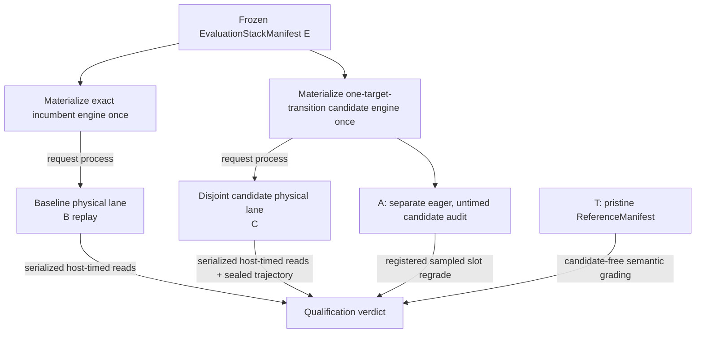

# Stacks and manifests

Cacheon represents evaluation state and semantic reference state as separate content-addressed objects. Neither is a product: nothing that wins in the referee ships by that fact.

## The two manifest roles

### Evaluation stack

`EvaluationStackManifest` is the complete incumbent used by the referee. It binds:

- the pinned runtime digest;
- the base engine digest;
- one registered arena digest;
- the exact target-catalog snapshot and digest;
- the active contribution reference for each target.

Every evaluation entry is a hostile `ProposalContributionRef`. Proposal references are legal only because the whole stack is materialized and executed inside the hostile evaluation boundary.

The evaluation stack is arena-specific. A result against one runtime, base engine, catalog, or arena cannot update another stack by name alone.

### Reference manifest

`ReferenceManifest` identifies the pristine validator-owned semantic authority used by qualification. It is candidate-free and untimed. It binds the trusted reference engine and the quality policy used to grade sealed candidate trajectories.

The reference does not compete on speed and is not the incumbent engine. This prevents an untrusted incumbent from becoming its own correctness oracle.

| Property | Evaluation stack | Reference |
|---|---:|---:|
| Hostile proposal entries allowed | Yes | No |
| Bound to one arena | Yes | Quality profile |
| Timed | Versioned paired-replay speed work | Never |
| Can update after a crown | Transactionally | No |
| Can be served as product | No | No |

## Canonical identity

Manifests are serialized with canonical JSON and domain-separated SHA-256 digests. Identity includes the complete catalog snapshot, not only a friendly target name. Unknown fields, stale schema versions, mismatched context digests, duplicate entries, and malformed contribution references fail closed.

This closes several ambiguity classes:

- a target cannot change meaning while retaining its name;
- an arena cannot silently change workload or topology under retained evidence;
- manifest map order cannot alter identity;
- a candidate cannot claim a different target after measurement.

Canonical digest construction lives in [`stack_identity.py`](https://github.com/latent-to/cacheon/blob/main/cacheon/stack_identity.py); strict manifest types live in [`stack_manifest.py`](https://github.com/latent-to/cacheon/blob/main/cacheon/stack_manifest.py).

### Stack digest, tree digest, and running-engine identity

These three identities answer different questions and should appear together in an audit:

| Identity | Answers | Changes when |
|---|---|---|
| Stack manifest digest | Which semantic contributions and catalog are selected? | A target entry, runtime/base identity, arena context, or catalog snapshot changes |
| Engine-tree digest | Which exact deterministic materialized files were emitted? | Selected source closure, direct-execution declaration, namespace rewriting, rebuild plan, or emitted inventory changes |
| Launch identity | Which exact engine was executed? | Tree, native publication, model, image, topology, graph mode, workload, or role changes |

Equal stack digests are not enough to claim equal execution if launch inputs differ. Equal
tree digests are not enough if a different model, native publication, or topology ran.

## Exact marginal substitution

The validator derives a candidate arm from the frozen incumbent. A valid registered-target arm changes exactly one target transition.



The target catalog determines the transition:

- a proposal replaces its own target's entry and nothing else, because targets have
  disjoint node roots;
- the other entries stay byte-identical;
- unregistered work fails resolution rather than being disguised as a target.

The planner records both the old and new contribution references, the selected-delta digest, and the exact target specification. See [`stack_plan.py`](https://github.com/latent-to/cacheon/blob/main/cacheon/stack_plan.py).

### Concrete substitution example

Suppose incumbent manifest `E0` contains `forward_pass = F0` and `prefix_cache = K`.
A proposal resolves to `forward_pass` as `F1`. Planning produces:

```text
incumbent = materialize(E0)                              # F0 + K on the incumbent lane
candidate = materialize(replace(E0, forward_pass, F1))  # F1 + K on the candidate lane
speed     = both lanes replay the sealed session slice in paired windows, then swap lanes
A         = separate eager, untimed candidate audit
T         = materialize(pristine reference)             # neither proposal is a grading oracle
```

The validator, not the proposal, performs `replace`. If the candidate passes, the
transition record names `F0 -> F1`; it does not give F1 ownership of K or of the
complete emitted engine tree.

## Cohorts

A qualification claim may bind a chain-ordered cohort `C1..Ck` to one frozen
incumbent. Cohorting does not weaken marginal identity:

- every candidate is derived from the same frozen incumbent digest;
- each candidate still changes exactly one registered target;
- candidate order is derived from committed authority rather than network arrival;
- each candidate receives a fresh authoritative qualification whose
  baseline replay is the exact incumbent;
- the retained qualification evidence binds each candidate to its own selected
  delta and physical-lane role assignment;
- the sealed speed policy alone decides from the retained windows, and
  unauthenticated or missing evidence yields `NO_DECISION`.

Cohorting is a scheduling optimization, not an economic change.

## Deterministic engine materialization

`engine_tree.py` turns a stack manifest into a closed engine source tree. Materialization does more than copy bundle directories:

1. reopen and inspect each referenced contribution;
2. verify source, metadata, CUDA, include, import, variant, and rebuild closure;
3. bind every contribution to its content and target-spec digests;
4. rewrite local Python and native names into deterministic contribution namespaces;
5. emit one canonical runtime manifest and rebuild plan;
6. record every emitted file and compute the logical tree digest;
7. reopen the emitted tree before it is accepted by launch code.

The resulting tree digest is separate from the stack digest. The stack identifies semantic composition; the tree identifies the exact emitted filesystem used to build and launch it. Both are retained.

## Seam activation is part of execution identity

The engine arms its adapters from the contributions registered in the materialized tree; arbitrary environment variable names do not cross the controller/worker protocol. Every incumbent read therefore loads the same incumbent contributions, C adds only its exact target delta, and T has no candidate activation. See [SGLang seam](seam.md).

## Build and launch identity

Materialized source is only one part of a running engine. The launch authority also binds:

- base image and runtime identity;
- model and tokenizer identity;
- topology and device allocation;
- native build specification and reopened publication digest;
- graph mode and relevant engine flags;
- workload, prompt, and role schedule;
- bounded host/worker protocol and evidence keys.

The controller prepares these inputs before timed execution. Production
qualification binds two isolated physical TP lanes and runs separate incumbent
and candidate engine processes on them, replaying each paired window
concurrently. Policy 17's second orientation boots fresh engines with the
physical incumbent and candidate lane roles exchanged.

A separate
no-GPU/no-network prebuild OCI compiles registered native products and publishes
them for reopening into one store shared by both lanes, so the swapped
orientation reuses the first orientation's builds. The disposable runtime worker
mounts that publication
read-only; its scheduler ranks may import sealed candidate Python, validate and
load native products, construct the engine, and execute, but they must never
compile or repair native code. Host-side timing and authenticated evidence bind
the runtime result back to the prepared launch identity.

Principal implementations are
[`eval/crossover_runtime.py`](https://github.com/latent-to/cacheon/blob/main/cacheon/eval/crossover_runtime.py),
[`eval/engine_launch.py`](https://github.com/latent-to/cacheon/blob/main/cacheon/eval/engine_launch.py),
[`eval/native_artifact.py`](https://github.com/latent-to/cacheon/blob/main/cacheon/eval/native_artifact.py),
and [`eval/oci_backend.py`](https://github.com/latent-to/cacheon/blob/main/cacheon/eval/oci_backend.py).

## Transactional stack updates

A passing qualification does not immediately mutate the incumbent. The settlement path reopens one complete audited passing qualification for the exact measured contribution identity. Historical paired evidence remains reopenable with its original identities and lower speedup.

For historical pairs, the equal core `SettlementReproductionIdentity` contains the arena digest,
target ID, selected-delta digest, hotkey, incumbent stack/tree digests, and
candidate stack/tree digests. The pair must also match broader contribution,
reservation, finalized-priority, manifest, member, and arm fields. Separately,
all seven authority/selection fields must differ: qualification authority,
plan, attempt, report, selection commitment, selection-secret commitment, and
selection evidence. Settlement conservatively uses the lower of the two
accepted speedups.

After the accepted qualification evidence reopens, settlement:

1. revalidate the target transition against the current stack;
2. project the crown and attributable credit;
3. write the transition and settlement evidence transactionally;
4. expose the new evaluation stack as the current incumbent.

If validation, persistence, or readback fails, the old stack remains authoritative. See [`settlement.py`](https://github.com/latent-to/cacheon/blob/main/cacheon/settlement.py) and [`chain/intake.py`](https://github.com/latent-to/cacheon/blob/main/cacheon/chain/intake.py).

### Failure behavior

| Failure | Resulting authority |
|---|---|
| Candidate tree cannot be reopened | No valid C arm; qualification does not begin or returns `NO_DECISION` according to stage policy |
| The incumbent reads do not reopen the same incumbent | Cohort authority is invalid; no candidate in the affected comparison can be crowned |
| Catalog changed after a qualification | Retained evidence remains historical, but it cannot be replayed as a transition against the new catalog by name alone |
| A historical pair names different reproduction identities | The pair is not settleable |
| Current incumbent changed before settlement | Transition is replanned/revalidated; stale evidence does not overwrite the live stack |
| Database transaction or evidence readback fails | The previous stack remains current and reward projection is held |

An operator should never “repair” these cases by editing a manifest digest or copying a
directory into the expected path. The mismatch is the evidence that the attempted state
transition lacks authority.

## No release path

There is no supported arrow from a mutable miner URL, chain record, evaluation bundle, or crown to serving. Integration into maintained source and any release are decisions made outside this repository; see [After a crown](../engine/integration.md).

## Source map

- [`stack_manifest.py`](https://github.com/latent-to/cacheon/blob/main/cacheon/stack_manifest.py) — strict manifest and contribution-reference types
- [`stack_plan.py`](https://github.com/latent-to/cacheon/blob/main/cacheon/stack_plan.py) — marginal arms, cohorts, and transitions
- [`engine_tree.py`](https://github.com/latent-to/cacheon/blob/main/cacheon/engine_tree.py) — deterministic source materialization
- [`target_catalog.py`](https://github.com/latent-to/cacheon/blob/main/cacheon/target_catalog.py) — registered targets and their node roots
- [`eval/reference_quality.py`](https://github.com/latent-to/cacheon/blob/main/cacheon/eval/reference_quality.py) — pristine reference quality products
- [`eval/calibration.py`](https://github.com/latent-to/cacheon/blob/main/cacheon/eval/calibration.py) — calibrated qualification/reference policy
