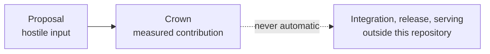

Bounded proposals · isolated evaluation · reviewed release boundary

# From untrusted GPU proposals to measured contributions.

Cacheon measures untrusted GPU optimization proposals as attributable contributions
and defines a separate review and release path for **Cacheon Engine**. SGLang owns
the serving control plane; Cacheon's contribution boundary is the inference data
plane. The current revision does not claim a completed production Engine release.

[Build a kernel](miner-guide/overview.md){ .md-button .md-button--primary }
[How miners earn rewards](miner-guide/incentives.md){ .md-button }
[Operate the referee](validator-guide/overview.md){ .md-button }
[Understand the architecture](architecture/overview.md){ .md-button }

## Why miners participate

Cacheon rewards independently reproduced performance improvements, not uploads or
self-reported benchmarks. If settlement crowns a proposal for a published target, it
records the corresponding reward claim in the same transaction. The validator later
combines eligible claims into a weight vector and publishes it on-chain; realized token
emission still depends on the wider Bittensor network.

[See the reward lifecycle in plain English →](miner-guide/incentives.md)

At the highest level, Cacheon has two systems: the chain-independent product and
the market that improves it. Operationally, the market side separates the
subnet control plane from the hostile-code referee, giving readers three
cooperating surfaces with different trust boundaries.

<a class="cacheon-card" href="engine/integration/">
<strong>Cacheon Engine</strong>
What a crown does and does not authorize, and how model bytes are provisioned.
</a>
<a class="cacheon-card" href="architecture/pipeline/">
<strong>The referee</strong>
Isolated, evidence-producing evaluation of one marginal target delta against a validator-owned incumbent stack.
</a>
<a class="cacheon-card" href="validator-guide/chain-loop/">
<strong>The subnet</strong>
Finalized proposal ordering, attribution, economic settlement, and weight publication. It is not part of the serving product.
</a>

## One idea, four objects

The system keeps two objects deliberately separate, and keeps both away from serving:

A miner submits a **proposal** for one registered target delta. The referee may
establish a **crown** after two independent passing qualifications. Whether crowned
source is ever integrated into maintained code is a maintainer decision outside this
repository. Work that does not fit
a registered target is not a valid proposal; widening the catalog is a reviewed
validator-side change.

[Learn the product model →](architecture/product-model.md)

## Why the architecture is composable

Every candidate runs as a complete isolated engine, but it is rewarded only for the
smallest validator-controlled delta it contributes. Authoritative qualification uses:

- **B** — the exact incumbent evaluation stack;
- **C** — the same stack with one registered target replaced;
- **B′** — a mandatory second incumbent read, the quality gate's stock-drift
  control;
- **A** — a separate eager, untimed sampled-audit role when registered; and
- **T** — a candidate-free pristine reference that grades sealed trajectories after
  candidate destruction.

Every candidate is measured by the two-process schedule: v8 (v9 for a
mixed-cell workload) launches separate baseline and candidate engines and
always takes B′. The earlier schedules (v1–v7) are sealed MiniMax-M3 history that
this tree no longer decodes. Primary and reproduction
attempts also exchange incumbent and candidate physical-lane roles. A persistent
hot-swap screen may route candidates before this schedule, but its measurements
cannot qualify or settle a contribution.

This separates the **execution unit** (a complete disposable engine) from the
**economic unit** (one singleton target or atomic target). A new optimization can
build on previous wins without repackaging or
copying them.

[Follow a proposal through the system →](architecture/pipeline.md)

## Choose your path

| Goal | Start here |
|---|---|
| Write a Triton, CuTeDSL, or Python reference kernel | [Miner guide](miner-guide/overview.md) |
| Validate the repository locally without a GPU | [Local quickstart](get-started/quickstart.md) |
| Deploy intake, an arena provider, and qualification workers | [Validator guide](validator-guide/overview.md) |
| See what a crown does and does not authorize | [After a crown](engine/integration.md) |
| Audit trust boundaries and failure behavior | [Security model](security/threat-model.md) |

## Evidence is scoped, not blended

Every performance or authority claim is scoped to the exact runtime, hardware, arena,
stack, identities, and procedure that produced it. Diagnostic measurements cannot
authorize a crown; crown evidence cannot authorize reviewed source; and release
verification cannot retroactively validate qualification.

!!! note "Source of executable truth"
    This [Cacheon repository](https://github.com/latent-to/cacheon) owns both
    executable contracts and this documentation. Content-addressed production
    evidence and immutable publications live in separate operator-owned stores.
    When prose and code disagree, the code, schemas, and tests in the same
    revision take precedence.
