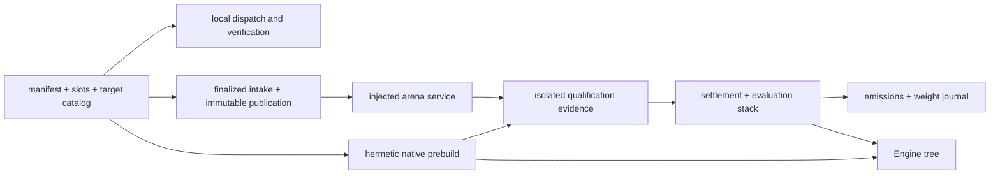

# Codebase map

This map groups the Cacheon source by authority boundary. File names are links
to the current code repository; source remains authoritative when details
change.

## Read by authority, not import depth

The easiest way to get lost in Cacheon is to follow imports as though every
module had the same trust level. Start from the decision whose authority you
are trying to understand:

The local branch is useful to contributors but cannot crown anything. The
intake, arena, qualification, settlement, and weight branch owns hostile
evaluation and economic state.

## Contribution contract

| Area | Primary source |
|---|---|
| Bundle parsing and path rules | [`manifest.py`](https://github.com/latent-to/cacheon/blob/main/cacheon/manifest.py) |
| Target identity and node roots | [`target_catalog.py`](https://github.com/latent-to/cacheon/blob/main/cacheon/target_catalog.py) |
| Node binding and audit against stock | [`sglang_nodes.py`](https://github.com/latent-to/cacheon/blob/main/cacheon/integrations/sglang_nodes.py) |
| Prefix-cache binding, content check, and state audit | [`sglang_cache.py`](https://github.com/latent-to/cacheon/blob/main/cacheon/integrations/sglang_cache.py), [`sglang_cache_state.py`](https://github.com/latent-to/cacheon/blob/main/cacheon/integrations/sglang_cache_state.py) |
| Static policy | [`sandbox.py`](https://github.com/latent-to/cacheon/blob/main/cacheon/sandbox.py) |
| Tracing-JIT admission | [`dsl_jit_policy.py`](https://github.com/latent-to/cacheon/blob/main/cacheon/dsl_jit_policy.py) |
| Local interface smoke and engine check | [`miner_check.py`](https://github.com/latent-to/cacheon/blob/main/cacheon/miner_check.py) |
| SGLang dispatch | [`dispatch.py`](https://github.com/latent-to/cacheon/blob/main/cacheon/dispatch.py), [`seams.py`](https://github.com/latent-to/cacheon/blob/main/cacheon/seams.py) |
| Sealed B300 arena-definition parsing and projection | [`b300_arena_definition.py`](https://github.com/latent-to/cacheon/blob/main/cacheon/eval/b300_arena_definition.py) |
| Scheduler-role candidate load | [`seam.py`](https://github.com/latent-to/cacheon/blob/main/cacheon/seam.py), [`sglang_scheduler_gate.py`](https://github.com/latent-to/cacheon/blob/main/cacheon/integrations/sglang_scheduler_gate.py) |

## Intake and referee

| Area | Primary source |
|---|---|
| Chain-facing commands | [`cli.py`](https://github.com/latent-to/cacheon/blob/main/cacheon/cli.py) |
| Miner S3-compatible publication | [`chain/publish.py`](https://github.com/latent-to/cacheon/blob/main/cacheon/chain/publish.py) |
| Miner commit-reveal submission | [`chain/submit.py`](https://github.com/latent-to/cacheon/blob/main/cacheon/chain/submit.py), [`chain/payload.py`](https://github.com/latent-to/cacheon/blob/main/cacheon/chain/payload.py) |
| Eval-cost quote and payment verify | [`chain/eval_cost.py`](https://github.com/latent-to/cacheon/blob/main/cacheon/chain/eval_cost.py), [`chain/eval_cost_payment.py`](https://github.com/latent-to/cacheon/blob/main/cacheon/chain/eval_cost_payment.py) |
| Finalized intake and SQLite state | [`chain/intake.py`](https://github.com/latent-to/cacheon/blob/main/cacheon/chain/intake.py) |
| Hardened archive fetch | [`chain/fetch.py`](https://github.com/latent-to/cacheon/blob/main/cacheon/chain/fetch.py) |
| Validator loop | [`chain/validator_loop.py`](https://github.com/latent-to/cacheon/blob/main/cacheon/chain/validator_loop.py) |
| One-shot evaluation-lease operations | [`chain/evaluation_lease_operator.py`](https://github.com/latent-to/cacheon/blob/main/cacheon/chain/evaluation_lease_operator.py) |
| Remote worker registration authority | [`chain/remote_worker_registration.py`](https://github.com/latent-to/cacheon/blob/main/cacheon/chain/remote_worker_registration.py) |
| Durable transport spool schemas | [`chain/remote_worker_spool.py`](https://github.com/latent-to/cacheon/blob/main/cacheon/chain/remote_worker_spool.py) |
| CPU SSH shuttle and spool transport | [`chain/ssh_worker_transport.py`](https://github.com/latent-to/cacheon/blob/main/cacheon/chain/ssh_worker_transport.py) |
| Pod worker service | [`chain/remote_worker_pod_service.py`](https://github.com/latent-to/cacheon/blob/main/cacheon/chain/remote_worker_pod_service.py) |
| Remote transport CLI composition | [`chain/remote_worker_service.py`](https://github.com/latent-to/cacheon/blob/main/cacheon/chain/remote_worker_service.py) |
| Standing CPU supervisor daemon | [`chain/standing_cpu_supervisor.py`](https://github.com/latent-to/cacheon/blob/main/cacheon/chain/standing_cpu_supervisor.py) |
| Qualification dispatch config, coordinator, and recovery | [`chain/mainnet_screen_dispatcher.py`](https://github.com/latent-to/cacheon/blob/main/cacheon/chain/mainnet_screen_dispatcher.py), [`chain/recoverable_qualification_dispatcher.py`](https://github.com/latent-to/cacheon/blob/main/cacheon/chain/recoverable_qualification_dispatcher.py) |
| B300 pod evaluation adapter | [`eval/b300_remote_worker_adapter.py`](https://github.com/latent-to/cacheon/blob/main/cacheon/eval/b300_remote_worker_adapter.py) |
| Redacted chain journal | [`chain/audit_log.py`](https://github.com/latent-to/cacheon/blob/main/cacheon/chain/audit_log.py) |
| Private validator snapshot/restore | [`chain/archive.py`](https://github.com/latent-to/cacheon/blob/main/cacheon/chain/archive.py) |
| Injected arena boundary | [`arena_service.py`](https://github.com/latent-to/cacheon/blob/main/cacheon/arena_service.py) |
| Qualification schema and regrading | [`eval/qualification.py`](https://github.com/latent-to/cacheon/blob/main/cacheon/eval/qualification.py) |
| Adaptive two-lane qualification | [`eval/crossover_runtime.py`](https://github.com/latent-to/cacheon/blob/main/cacheon/eval/crossover_runtime.py), [`eval/qualification_runner.py`](https://github.com/latent-to/cacheon/blob/main/cacheon/eval/qualification_runner.py) |
| Standing qualification composition | [`eval/b300_qualification_deployment.py`](https://github.com/latent-to/cacheon/blob/main/cacheon/eval/b300_qualification_deployment.py), [`eval/b300_registered_qualification.py`](https://github.com/latent-to/cacheon/blob/main/cacheon/eval/b300_registered_qualification.py) |
| Sealed qualification input authorities | [`eval/b300_registered_qualification_inputs.py`](https://github.com/latent-to/cacheon/blob/main/cacheon/eval/b300_registered_qualification_inputs.py) |
| Physical qualification lane pair | [`eval/b300_qualification_lanes.py`](https://github.com/latent-to/cacheon/blob/main/cacheon/eval/b300_qualification_lanes.py) |
| Remote qualification evidence products | [`chain/remote_qualification_evidence.py`](https://github.com/latent-to/cacheon/blob/main/cacheon/chain/remote_qualification_evidence.py) |
| Remote qualification adapter | [`eval/b300_remote_qualification_adapter.py`](https://github.com/latent-to/cacheon/blob/main/cacheon/eval/b300_remote_qualification_adapter.py) |
| Bundle and committed-source identity | [`bundle_hash.py`](https://github.com/latent-to/cacheon/blob/main/cacheon/bundle_hash.py) |
| Host audit grading | [`audit_gate.py`](https://github.com/latent-to/cacheon/blob/main/cacheon/audit_gate.py) |
| OCI lifecycle and protocol | [`eval/oci_backend.py`](https://github.com/latent-to/cacheon/blob/main/cacheon/eval/oci_backend.py), [`eval/oci_session_protocol.py`](https://github.com/latent-to/cacheon/blob/main/cacheon/eval/oci_session_protocol.py) |
| Current speed substrate | Paired replay (speed policy 17) in [`eval/goodput_runtime.py`](https://github.com/latent-to/cacheon/blob/main/cacheon/eval/goodput_runtime.py), [`eval/crossover_runtime.py`](https://github.com/latent-to/cacheon/blob/main/cacheon/eval/crossover_runtime.py) and [`eval/agent_replay.py`](https://github.com/latent-to/cacheon/blob/main/cacheon/eval/agent_replay.py) |
| Statistical speed grade | [`eval/service_capacity.py`](https://github.com/latent-to/cacheon/blob/main/cacheon/eval/service_capacity.py) |
| Immutable native prebuild and the store both lanes share | [`eval/oci_prebuild.py`](https://github.com/latent-to/cacheon/blob/main/cacheon/eval/oci_prebuild.py) |
| Device conditioning/cleanup | [`eval/device_state.py`](https://github.com/latent-to/cacheon/blob/main/cacheon/eval/device_state.py) |

## State, economics, and weights

| Area | Primary source |
|---|---|
| Evaluation stack identities | [`stack_manifest.py`](https://github.com/latent-to/cacheon/blob/main/cacheon/stack_manifest.py) |
| Transactional settlement state | [`chain/intake.py`](https://github.com/latent-to/cacheon/blob/main/cacheon/chain/intake.py) |
| Accepted qualification candidates | [`settlement_acceptance.py`](https://github.com/latent-to/cacheon/blob/main/cacheon/settlement_acceptance.py) |
| Reward comparison against the previous best PASS | [`chain/evaluation_order.py`](https://github.com/latent-to/cacheon/blob/main/cacheon/chain/evaluation_order.py) |
| Pure emissions projection | [`economics.py`](https://github.com/latent-to/cacheon/blob/main/cacheon/economics.py) |
| Weight publication reconciliation | [`chain/weights.py`](https://github.com/latent-to/cacheon/blob/main/cacheon/chain/weights.py) |
| Copy and attribution evidence | [`copy_fingerprint.py`](https://github.com/latent-to/cacheon/blob/main/cacheon/copy_fingerprint.py) |

## Engine integration

| Area | Primary source |
|---|---|
| Deterministic Engine tree | [`engine_tree.py`](https://github.com/latent-to/cacheon/blob/main/cacheon/engine_tree.py) |
| Model provisioning | [`model_provision.py`](https://github.com/latent-to/cacheon/blob/main/cacheon/model_provision.py) |

## Compatibility

| Area | Primary source |
|---|---|
| SGLang pin and canary | [`compat.py`](https://github.com/latent-to/cacheon/blob/main/cacheon/compat.py) |
| Bittensor SDK canary | [`chain_canary.py`](https://github.com/latent-to/cacheon/blob/main/cacheon/chain_canary.py) |

## Follow a concrete task

### “Why was this bundle rejected?”

Read in this order:

1. `manifest.py` for exact TOML shape and contained-path rules;
2. `sandbox.py` for observed source/build features;
3. `target_catalog.py` for target resolution and admitted features; and
4. `miner_check.py` and `integrations/sglang_nodes.py` for the entry interface and
   the audit against stock.

This ordering separates syntax, capability admission, ABI, and numerical
failure. They are different diagnoses even when the CLI reports them in one
run.

### “How did a finalized reveal become a crown?”

Start at `chain/intake.py`, then follow `chain/fetch.py` and
`chain/publication.py` into `chain/validator_loop.py`. The loop reserves finalized
order and publishes bundles; `chain/standing_cpu_supervisor.py` and
`chain/evaluation_coordinator.py` claim qualification work, persist evidence
references, and invoke transactional settlement. Read
`eval/qualification_runner.py` alongside `eval/qualification.py`: the runner
orchestrates work; the schema and regrader define what counts as authority.

One complete audited PASS makes the reservation `qualified` and may settle the
contribution and advance the evaluation stack. Console output and evaluator summary
text are never the settlement input.

### “Why did weight publication remain pending?”

Read `economics.py` first: it computes the pure global projection from reopened
active contribution state. Then read `chain/weights.py`: it refreshes the live
metagraph, journals intent before submission, records SDK results without
treating them as confirmation, and reconciles later chain observation. The journal stores
status/chronology metadata and a projection digest, not raw pre/post readback vectors.
`--dry-run` creates no journal intent, while reconciliation and submission have
different durable states.

### “What exactly ships?”

Follow `stack_manifest.py` into `engine_tree.py` and `model_provision.py`.
The selected payload remains bound to its crowned digest; later
materialization owns deterministic module namespaces and packaging. This
repository contains no release product or release commands; the subnet does not
need one to run.

## State and evidence locations

| Object | Owner | Identity / persistence rule |
|---|---|---|
| Parsed bundle | Contributor/diagnostic process | Content hash over the admitted bundle tree |
| Finalized publication | Intake controller | Validator-owned immutable worker publication |
| Qualification evidence | External evidence root plus deployment-owned expected plan/provider context | Typed attempt and referenced artifacts; full regrade additionally requires reconstructed `CausalQualificationInput`, while settlement restart performs narrower byte/PASS authentication |
| Evaluation stack | Referee state | Canonical manifest that may reference hostile proposals |
| Settlement and weight state | Chain-scoped SQLite controller | Transactional single-writer state plus projection-linked intent/status journal; live readback vectors are not serialized |
| Validator recovery snapshot | Private S3-compatible object store | Consistent SQLite image plus database-referenced publications/evidence, redacted journal, and explicit sealed inputs under a closed digest-bound manifest; staged restore never replaces live state |
| Integrated source | Reviewed source control | Full reviewed commit plus selected-payload and attribution digests |

Paths are deliberately not identities. A local directory name, URL, database
row number, or registry tag cannot replace the corresponding digest-bound
object.

## Tests as executable maps

Tests mirror the authority boundaries rather than one monolithic integration
fixture:

- `test_static.py` and `test_target_catalog.py` cover hostile
  input and target admission;
- `test_stack_manifest.py`, stack-planning tests, and `test_engine_tree.py`
  cover canonical composition and integration materialization;
- qualification, OCI, audit, and reference-protocol tests cover the paired
  replay, registered eager audit A, and pristine T;
- chain-intake, settlement, economics, and weight-publication tests cover
  durable economic transitions; and
- `test_chain_publish.py` and `test_chain_archive.py` cover public proposal
  transport and private digest-bound recovery respectively.

When learning a type, search for both its successful construction and its
rejection tests. The negative cases usually reveal which fields are security
inputs rather than descriptive metadata.

## Production authority entry points

Development helpers and test fixtures are not alternate qualification authorities. Audit
production intake from the validator loop and durable intake store, then follow the
registered arena, qualification runner, settlement transition, and weight-publication
journal. A path that does not emit and reopen the typed products for those boundaries
cannot substitute for them.

Tests are organized under `tests/` by the same boundaries. Contract tests are
often the clearest executable examples because they build exact typed objects
and assert fail-closed behavior.
