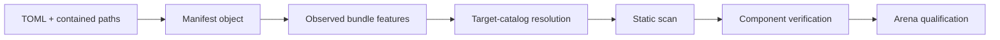

# Bundle manifest

Every contribution bundle has a `manifest.toml`. The manifest is parsed as
data before any contribution module is loaded. Its current ABI identifier is
`cacheon-op-abi-v0`. Branding does not version this hash-bound protocol
identifier, so Cacheon authors continue to emit the published spelling.

## What parsing does—and does not do

A manifest passes through distinct layers:



`load_manifest()` covers only the first step: required syntax, identifier
shape, path containment/existence, variant uniqueness, and structural CUDA
declarations. It does not import source, prove that the requested target
exists, or verify numerical behavior. `scan`, target resolution, `verify`, and
production qualification are separate gates so a structurally valid document
cannot grant itself authority.

## Minimal node example

```toml
bundle_id = "example-mlp-v1"
abi_version = "cacheon-op-abi-v0"

[competition]
target = "forward_pass"
mode = "slot"

[[ops]]
slot = "model.layers.*.mlp"
source = "kernel.py"
entry = "forward"
dtypes = ["bfloat16"]
```

`bundle_id` and identifiers accept letters, numbers, `.`, `_`, and `-`.
Paths are relative to the bundle and must resolve to regular contained files.

## Top-level fields

| Field | Required | Meaning |
|---|---:|---|
| `bundle_id` | yes | Human-readable bundle identifier; not the content identity |
| `abi_version` | yes | New bundles must emit `cacheon-op-abi-v0`; the reader also accepts the exact hash-bound pre-cutover spelling described below |
| `[competition]` | recommended | Explicit requested target and `slot` mode |
| `[[ops]]` | yes | One or more implementation rows |

New bundles must use `cacheon-op-abi-v0`. Validators also retain one narrowly
scoped reader-only compatibility spelling, `optima-op-abi-v0`, for finalized
bundles committed before the rename. Readers preserve the submitted spelling
and bytes; they do not rewrite a publication because the spelling participates
in the committed bundle identity. Every other ABI spelling is refused.

The canonical bundle hash, not `bundle_id`, is the proposal's content identity.

### Identity versus display name

The content hash walks the bundle's own regular files in sorted relative-path
order and hashes length-prefixed path and byte sequences. Git and Python cache
noise is excluded; symlinks are not part of the hashed file set and the bundle
loader/scanner rejects unsafe tree structure. Editing source, metadata,
or even the manifest produces a new identity. Renaming only the outer
directory does not.

`bundle_id` is useful in logs and diagnostics but never proves that two reveals
contain the same artifact. Commit/reveal, immutable publication, copy checks,
and qualification use digest-bound content.

### Competition table

| Field | Values |
|---|---|
| `target` | A validator-registered target ID |
| `mode` | `slot`; `atomic` and `system` parse only so retained legacy bundles stay readable, and do not resolve |
| `arena` | Exact logical arena ID; omitted or empty selects the existing default competition |

The table is a request, not policy. Intake resolves it against the frozen
[target catalog](target-catalog.md) and complete observed feature set. The
current resolver infers the target whose node roots hold every declared
address. New competitive bundles should declare `[competition]` explicitly. Additional arenas
require an explicit `arena`, for example `arena = "glm53-b300-node-v1"`.
It participates in the bundle hash and selects one evaluation; submissions are
not broadcast to every model.
An unknown selector stays unclaimed and is subject to the ordinary intake SLA.

## Operation rows

| Field | Required | Meaning |
|---|---:|---|
| `slot` | yes | A [node address](../architecture/slot-contract.md#node-addresses) such as `model.layers.*.mlp` (target `forward_pass`), or `tree_cache` (target `prefix_cache`) |
| `source` | yes | Python source module within the bundle |
| `entry` | yes | Entry callable name |
| `variant` | conditional | Capability variant; required on every row when a slot repeats |
| `prepare` | no | `prepare(module)`, called once per bound node |
| `setup` | development only | Legacy parser/direct-framework diagnostic hook; every registered component target forbids it |
| `dtypes` | no | Declared dtype capability domain; an empty array adds no dtype restriction |
| `architectures` | no | Declared architecture capability domain; an empty array adds no architecture restriction |
| `metadata` | no | Eligibility/capability JSON within the bundle |
| `base_kernel`, `override_point` | no | Retired override composition fields; target resolution refuses a row that sets either |
| `cuda_sources` | no | Inspectable `.cu`/`.cuh` inputs for a reviewed builder |

Unknown operation fields are retained for observation. They do not grant a
capability; complete feature resolution can reject a bundle that asks for more
than its target admits.

### How an operation row is selected

The `slot` chooses a validator-owned semantic ABI, not an arbitrary import
hook. The validator resolves `source` inside the bundle and looks up the named
Python identifier only after structural and static gates. Candidate code does
not redefine shapes, references, tolerances, or the call site.

A node-address row is called in place of the named module: `entry`
receives the prepared state and then the module's own forward arguments, and
returns what the module would. Every row of such a bundle is a node address, no
two rows may overlap, and the bundle resolves to `forward_pass` whether or not
`[competition]` names it. A `tree_cache` row's `entry(cache)` returns the cache class.

For prepare/forward slots, `prepare` names the registered one-time weight
transformation while `entry` names the runtime call. `setup` is a legacy direct
framework hook and every current component target forbids it, so new
competitive manifests should not use it.

### Variants

Several rows may implement the same semantic slot only when every row has a
unique explicit `variant`. Their validator-parsed capability domains must not
overlap. Runtime selection is fail-closed: exactly one applicable variant is
required, otherwise the trusted baseline is used or qualification refuses the
candidate according to the registered boundary.

Empty or omitted `dtypes` and `architectures` do not mean “supports nothing”;
they add no restriction at the manifest-parser layer. Eligibility metadata and
validator observation still constrain the real capability domain. Conversely,
listing `sm103` does not prove the source builds or runs there.

```toml
[[ops]]
slot = "model.layers.*.mlp"
variant = "sm90-bf16"
source = "mlp_sm90.py"
entry = "forward"
dtypes = ["bfloat16"]
architectures = ["sm90"]

[[ops]]
slot = "model.layers.*.mlp"
variant = "sm103-bf16"
source = "mlp_sm103.py"
entry = "forward"
dtypes = ["bfloat16"]
architectures = ["sm103"]
```

This example demonstrates variant syntax only; check
[Arena availability](../miner-guide/slots.md#arena-availability) before paying
for a submission.

CUDA source declarations behave similarly. Listing `.cu`/`.cuh` paths makes
them inspectable inputs to the sanctioned build lane; it is not permission to
ship a prebuilt binary or execute an arbitrary compiler command. Rebuild
operations come from reviewed validator policy.

## What the manifest cannot do

A bundle cannot choose:

- its reward family, overlap, or displacement;
- arena hardware, workload, thresholds, or hidden tasks;
- the incumbent or reference stack;
- isolation or network policy;
- qualification, reproduction, or settlement outcomes.

## Failure diagnosis

| Error class | Typical cause | Fix the right layer |
|---|---|---|
| TOML/required-field error | Missing `[[ops]]`, wrong ABI string, invalid identifier | Correct manifest syntax |
| Path error | Absolute path, `..` escape, missing file, unsafe symlink | Keep every declared input as a regular contained file |
| Duplicate-slot error | Multiple rows without explicit unique variants | Name every variant and make domains disjoint |
| Competition error | Unknown target, wrong `slot`/`atomic` mode, legacy `system` title | Choose a registered target from validator output |
| Feature-admission error | `setup`, a retired override field, or an extra capability outside target policy | Remove the feature |
| CUDA-source declaration error | Missing, uncontained, or non-`.cu`/`.cuh` input | Declare contained source paths in `cuda_sources`; build admission remains validator-owned |
| Static scan error | Forbidden import/operation or uninspectable tree content | Rewrite the source; scanning is not a sandbox exception list |
| Verification error | Import or entry-signature mismatch (`verify`), or audit violations against stock (`check`) | Match the node's stock arguments and result structure |
| Qualification failure | Complete engine misses timing, drift, quality, fidelity, or resource gates | Inspect retained arena evidence; do not relabel the outcome |

## Pre-submission checklist

- Choose `forward_pass` (node addresses) or `prefix_cache` (`tree_cache`).
- Declare `[competition]` explicitly.
- Keep `bundle_id` descriptive but assume only the content hash is identity.
- Declare every source, metadata, and CUDA input with a contained relative
  path; `.patch`/`.diff` files are refused.
- Give repeated slot rows unique variants with non-overlapping domains.
- Avoid `setup`; use only registered `prepare` and entry contracts.
- Run `scan` and `verify`, then `check` in the published arena image.
- Hash and package the exact verified tree; any later byte change is a new
  proposal.

Source: [`cacheon/manifest.py`](https://github.com/latent-to/cacheon/blob/main/cacheon/manifest.py).
