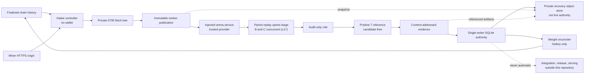

# Validator and operator guide

This repository implements the **referee plane**: it accepts proposals, measures
marginal improvements, retains evidence, settles target ownership, and projects
rewards. Integration, release, and serving are separate authorities outside this
repository. A crowned miner bundle is still hostile proposal material. It is not a
production release, and a serving fleet never needs chain access or a miner-hosted URL.

!!! important
    The public `cacheon chain-validate` command runs finalized **intake only**.
    Qualification and settlement run in the standing supervisor against a commissioned
    `ArenaService`. This repository defines the typed interface and enforcement logic;
    it does not ship a production arena provider.

## Deployment topology

The production design is a set of authorities, not one privileged daemon. A practical
deployment has at least four independently supervised roles:

The boxes imply operational boundaries:

- **Intake host:** reads finalized chain state and untrusted HTTPS, owns the private
  tree and SQLite scope, but needs no wallet.
- **Arena control plane:** owns the registered service manifest, provider implementation,
  capacity policy, selection secrets, and qualification construction. Candidate metadata
  cannot select any of them.
- **Execution fleet:** receives immutable, content-addressed inputs and runs hostile
  engines under the OCI controller. It receives neither wallet material nor release keys.
- **Signer:** opens the same durable authority only for a coordinated reconciliation
  window, refreshes live metagraph state, and uses the validator hotkey. The store's
  nonblocking process lock prevents concurrent controllers from silently sharing it.
- **Recovery mirror:** receives consistent, digest-bound snapshots from a separate job.
  It is private off-pod storage, not a live database, evidence filesystem, or wallet
  store, and restore always stages into a fresh root for review.
- **Release and serving plane:** starts only from reviewed integrated source. It does not
  mount proposal publications, evidence roots, the intake database, or chain credentials.

They can be colocated for development, but colocation does not merge their authority.
For example, putting the signer on the intake host does not permit `chain-validate` to
open the wallet, and putting a release builder beside the worker fleet does not make a
crown deployable.

## Production flow

The current validator path is deliberately staged:

1. Read every newly finalized reveal in canonical chain-event order.
2. Reserve that order durably in a single-writer SQLite store.
3. Fetch the committed archive over HTTPS, enforce transport and extraction limits,
   and rederive the committed content hash.
4. Resolve the submitted delta to one registered target and compute copy
   fingerprints over submitted bytes only.
5. Copy the private intake tree into an immutable worker publication.
6. Admit the publication to its arena's qualification queue at first claim:
   duplicate FAIL replay, closed-target release, and capacity limits apply here.
   There is no separate screen.
7. Qualify admitted candidates under the version-3 protocol: a paired replay
   of B and C in both lane orientations (speed policy 17), then audit and
   pristine T.
8. Reopen the complete audited PASS and apply target and evaluation-stack changes
   in one settlement transaction.
9. Reconcile the global reward projection from a separate signer process.

One reservation therefore crosses three different kinds of state:

| Phase | Durable state or product | Who may advance it |
|---|---|---|
| Arrival | Finalized cursor and `reserved` row | Intake controller |
| Transport | `fetching` → `transport_retry`, `failed`, or `published` | Intake controller |
| Admission | `published` queue; duplicate replay `failed`, closed target `expired`, or capacity `held` | Registered arena service through the controller |
| Qualification | `qualifying` → `qualified`, `failed`, or `no_decision` | Qualification authority plus transactional store projection |
| Settlement | Leased candidate, event journal, stack generation, active claims | Pure planner plus SQLite transaction |
| Emissions | Legacy V1 standing projection and append-only publication journal | Separate weight reconciler |
| Shipping | Integration record and signed release | Release authority, never the settlement loop |

`FAIL` and `NO_DECISION` are intentionally different. `FAIL` is an attributable terminal
candidate disposition under a frozen rule. `NO_DECISION` means the validator lacks fair,
complete authority and may retry or hold the work. Operators must preserve that distinction
in alerts, dashboards, and manual procedures.

Read [The chain loop](chain-loop.md), [Arena service](arena-service.md),
[Qualification](qualification.md), and
[Settlement and weights](settlement-and-weights.md) in that order.

## Authorities that must stay separate

| Authority | Owns | Must not trust |
|---|---|---|
| Chain intake controller | Finalized order, reservations, private fetch, publication, durable state | Network arrival order, miner paths, mutable hosted bytes |
| Arena service | Runtime/model/topology/workload identity, capacity, qualification-plan construction | Submission-provided module paths or commands |
| OCI execution controller | Resident lane roles, paired windows, mounts, deadlines, device observations, protocol, teardown | Candidate process, candidate clocks, candidate quality claims |
| Audit-only role | Exact slot × rank/PID witness graded by the trusted host | Candidate-side audit or framework output |
| Pristine reference T | Untimed teacher-forced quality evidence | Candidate C or the incumbent engine as grading oracle |
| Settlement store | Reopened audited PASS evidence, target transitions, reward claims | An unreopened report or stale incumbent identity |
| Weight signer | Wallet, live metagraph, publication journal, chain readback | An SDK “submitted” return value as confirmation |
| Release authority | Integration review, model seal, release key, deterministic artifacts | A crown as automatic permission to ship |

## Operator surfaces

| Task | Supported surface |
|---|---|
| Inspect SGLang seam and SDK compatibility | `cacheon compat`, `cacheon chain-compat` |
| Publish and submit a proposal | `cacheon chain-publish`, `cacheon chain-eval-cost`, `cacheon chain-submit` |
| Inspect chain state | `cacheon chain-status` |
| Inspect private reservation/miner outcomes | `cacheon chain-reservation-status`, `cacheon chain-miner-report` |
| Grant/list one-use eval-cost make-goods | `cacheon chain-eval-cost-credit` |
| Run bounded finalized public intake | `cacheon chain-validate --intake-only` |
| Run the standing qualification/settlement/offer loop | `python -m cacheon.chain.standing_cpu_supervisor --config <SEALED_CONFIG>`; deployment supplies sealed capabilities and transport identities |
| Publish a private recovery snapshot | `cacheon chain-snapshot` |
| Verify or stage a recovery snapshot | `cacheon chain-snapshot-verify` |
| Reconcile legacy V1 rewards | `cacheon set-weights`, optionally `--watch`, in a separate control-plane process |
| Project an all-uncrowned V1 bootstrap | `cacheon set-weights --burn-hotkey <REGISTERED_HOTKEY>` |
| Burn continuously to the subnet owner | `cacheon set-weights --burn-to-subnet-owner --watch` (journaled bootstrap; stops at the first CROWN; `--dry-run` to stop before signing) |
| Seal model bytes | `cacheon model-provision` |

`scan`, `verify`, and `check` are contributor diagnostics. Contributor-controlled paired
profiling is useful before submission and during integration, but its output is not a
crown, a settlement record, or weight authority. See
[Verification and diagnostics](running-evals.md).

## Durable state

Production referee state lives in `FinalizedIntakeStore`. The store binds its database to
a chain genesis hash and netuid, records finalized
priority, and carries each reservation through fetch, qualification,
settlement, and weight-publication state. WAL mode, full synchronous
writes, a process lock, and explicit restart recovery make partially completed work
visible rather than silently replaying it.

The SQLite database is also the join point between intake, settlement, and weight
publication. It is not a generic shared database service: one `FinalizedIntakeStore`
owner holds an exclusive filesystem lock while open. Schedule signer runs between
validator passes or stop the controller cleanly for reconciliation; do not add a second
writer, copy a live WAL database into place, or remove the lock file to force access.

Immutable publications and evidence roots are durable dependencies of standing state.
Deleting them after a crown can make later settlement reopening or reward projection
fail closed. Treat retention, backup, and restore as part of consensus
operations, not log rotation.

`chain-snapshot` supplies the implemented off-pod recovery format: a SQLite online
backup, the redacted chain journal, database-referenced worker publications and retained
qualification artifacts, and only explicitly named sealed inputs. Blobs and the closed
manifest are digest-bound and reopened after upload. `chain-snapshot-verify` stages and
semantically reopens them without replacing live state. Models and OCI images are not
included; object-store privacy, encryption, versioning/object lock, lifecycle, and
restore-cutover policy remain operator responsibilities.

## Failure ownership

Use the authority boundary to decide who absorbs a failure:

| Failure | Economic treatment | Operator action |
|---|---|---|
| Invalid payload, committed-hash mismatch, unsafe archive, attributable qualification violation | Candidate `FAIL` | Retain reason/evidence; no automatic retry |
| DNS/TLS timeout, publication storage fault, controller crash, excessive baseline drift, missing evidence authority | `NO_DECISION`, retry, or `held` | Repair validator infrastructure, then use the bounded retry/release path |
| Queue or cohort capacity exceeded | Queue while within policy; otherwise `held` | Add capacity or review the registered bounds; never reorder by fetch completion |
| Settlement incumbent or journal head changed | Abort/hold; no partial transaction | Reopen current authority and re-plan |
| Commissioned qualification incumbent differs from the durable evaluation stack | Refused before any lease, request, or GPU action; no candidate signal | Recommission from the current crowned stack |
| Weight readback missing or divergent | Publication `held`; a hold over an attempt the chain never saw releases itself | Preserve journal, audit chain state, append an explicit release only after review |

Developer-local state and profiler output do not describe production economics and cannot
replace any durable intake, qualification, settlement, or weight-publication product.

## What the implementation does not claim

- It does not provide a turnkey production arena provider or fleet scheduler.
- It does not make direct diagnostic execution safe for crownable work.
- It does not make a single validator's measurement globally trustworthy; validator
  consensus and deployment policy remain external system concerns.
- It does not eliminate workload overfitting, GPU/driver vulnerabilities, denial of
  service, or release-key operational risk.
- It does not automatically ship a crowned proposal.
- It does not implement V2 finite-debt economics; only its reserved durable schema
  remains.
- It does not construct, sign, or serve an Engine release.

Security assumptions and residual risks are detailed in
[Threat model](../security/threat-model.md) and [Isolation](../security/isolation.md).

## Source anchors

- [Product model](../architecture/product-model.md)
- [Finalized validator loop](https://github.com/latent-to/cacheon/blob/main/cacheon/chain/validator_loop.py)
- [SQLite intake authority](https://github.com/latent-to/cacheon/blob/main/cacheon/chain/intake.py)
- [Private validator archive](https://github.com/latent-to/cacheon/blob/main/cacheon/chain/archive.py)
- [Arena service contract](https://github.com/latent-to/cacheon/blob/main/cacheon/arena_service.py)
- [Settlement planner](https://github.com/latent-to/cacheon/blob/main/cacheon/settlement.py)
