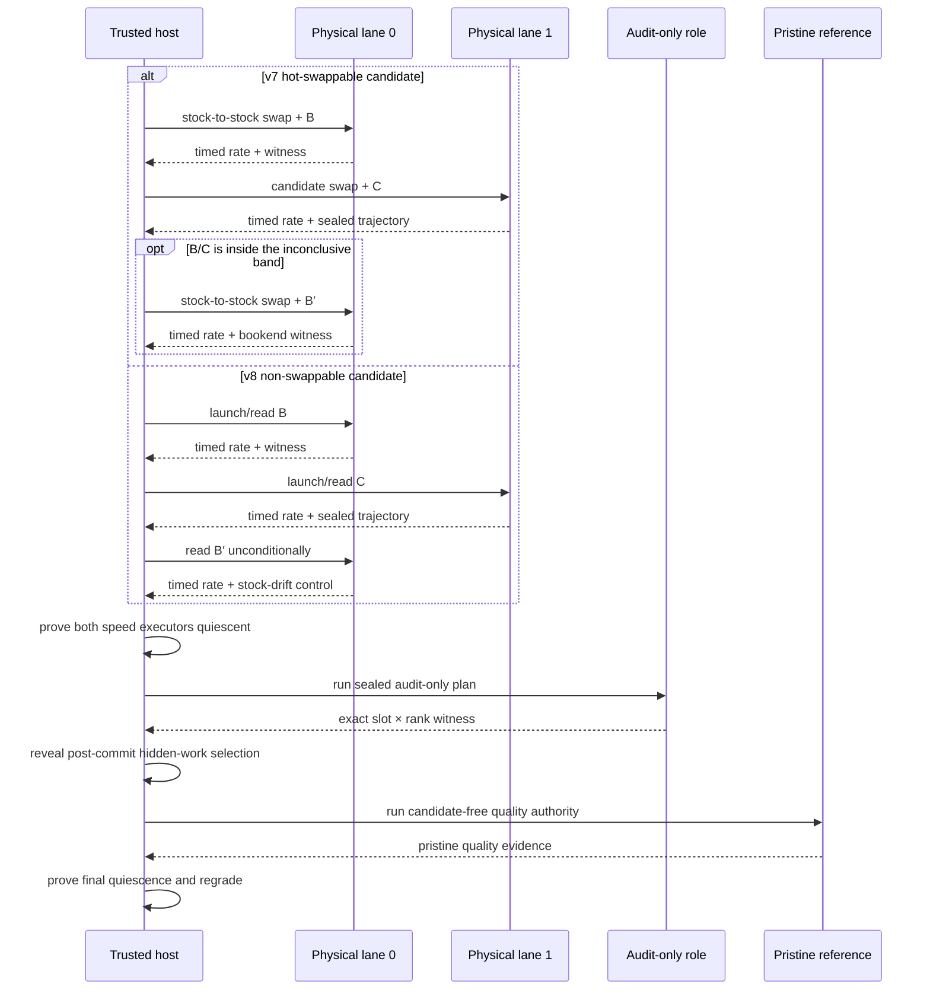

# Authoritative qualification

Qualification asks a narrow question: does one exact submitted delta improve one frozen
evaluation stack, in one registered arena, at acceptable quality?

The production answer comes from the version-3 qualification protocol executed
by a trusted host controller. Hot-swappable candidates use the standing pair of
isolated TP lanes; non-swappable candidates use separate baseline and candidate
engine processes on the same sealed physical-lane authority. Timed GPU work is
serialized in either case. The answer does not come from a routing screen, local
diagnostic launch, candidate-side self-audit, miner report, or arbitrary
evaluator command.

## Identities before execution

Before a candidate runs, the validator binds:

- finalized reservation and hotkey;
- arena service and workload;
- target catalog and exact singleton or atomic target;
- submitted-delta digest;
- incumbent and candidate `EvaluationStackManifest` digests;
- materialized engine-tree and launch identities;
- model, runtime, topology, native build, seccomp, and worker distribution;
- calibration, resident speed, physical-lane, slot-audit, and graph-verification
  requirements; and
- selection commitment, private selection secret reference, and candidate order.

For a registered candidate, C is the incumbent stack with exactly one target replaced.
Every other contribution, adapter, fallback, and engine setting is supplied by the
validator.

There are three nested identities to keep straight:

| Identity | What it fixes | Why it matters |
|---|---|---|
| Reservation | Finalized arrival, hotkey, publication, target members, submitted delta | Prevents a later file tree or miner from inheriting the attempt |
| Qualification authority | Frozen source/plan, candidate order, selection commitment, arena/calibration/runtime identities | Prevents the evaluator from changing the experiment after admission |
| Reproduction identity | Arena, target, delta, hotkey, and exact incumbent/candidate stack and tree digests | Defines what the second independent PASS must reproduce |

Paths are not identities. Moving the same publication or evidence store does not change
the content digests, while rebuilding “equivalent” source under new bytes does.

## Speed-policy versions

Retained attempts identify the speed policy that created them:

| Version | Timed reads | Purpose |
|---|---|---|
| v1 | B/C/B′ | Historical byte-compatible authority |
| v2 | B/C/B′/C′/B″ | Fixed repeat-read authority |
| v3 | B/C/B′, then C′/B″ only when borderline | Resident adaptive authority |
| v4 | as v3 | Every read graded; bookend invariance decides |
| v5 | as v3 | Adds the bracket-drift exclusion |
| v6 | B/C, then B′ only when a legal bookend could reverse it | Conditional bookend |
| v7 | as v6 | Adds the symmetric baseline swap |
| v8 | B/C/B′, always three | Two-process substrate for non-swappable candidates |

Versions 6 and 7 belong to the resident pair, where the candidate is hot-swapped
into a loaded engine. A candidate that cannot be hot-swapped — one declaring CUDA,
C++ or PTX sources, AOT artifacts, dependency patches, or engine setup — is
measured by the two-process crossover instead, which launches its own baseline and
candidate engines. That substrate binds v8 and reads B′ unconditionally: the
quality gate takes its stock-drift control from the second baseline read, and a
conditional bookend leaves a clear PASS with no control to harvest. Reading it
regardless of the outcome also preserves what the conditional versions enforce — a
read taken regardless of a result cannot be a read taken because of one.

The version is selected per candidate when the qualification plan is built, from
the same swappability predicate the worker routes execution on, so the plan and
the execution substrate cannot disagree. Only the read order differs: every
calibrated threshold is the one the provider sealed.

C′ and B″ are unreachable under v6, v7 and v8. The five-arm bracket survives only
in v2–v5 evidence.

Fresh execution is resident-only: the runner refuses any other speed-evidence
policy at entry, and the constructor default is the resident policy — the only
one a fresh plan can run. Versions 1 and 2 survive as reopen vocabulary: a
reopen binds the retained evidence's own policy explicitly, and historical
serialized artifacts regrade byte-for-byte without reinterpretation. Merely
changing the policy label does not upgrade old evidence.

## Current adaptive timeline

The version-3 protocol binds two non-overlapping physical TP lanes, equivalent
topology, separate runtime namespaces, lane-specific NUMA policy, exact
workload, and a total qualification budget. V7 keeps the standing pair resident;
v8 launches its baseline and candidate processes for the request. The controller
permits only one lane to execute timed GPU work at a time.

Every read's evidence carries the engine-observed prompt token count for each request,
and the protocol layer rejects any read whose counts differ from the sealed workload
cell before it can be graded. A nominal host-side token count is never authority, and a
count mismatch is an infrastructure fault — it can hold the leg, never mint a candidate
verdict.

V7 decides clear wins and losses from B/C under precommitted invariant bounds;
only the inconclusive band authorizes B′. V8 always reads B/C/B′ because the
quality stage requires a second stock observation. C′/B″ are unreachable in
both current policies. The candidate cannot request extra reads. The retained
witness records which reads occurred, lane identities, operational timing, and
the stage and total budgets.

Speed is graded before the expensive audit and pristine-reference stages. An ordinary
speed non-PASS emits a durable stage-exit and does not run audit or T. A separately bound
calibration-observation disposition may continue after a speed failure to collect
diagnostic audit and T evidence, but it cannot crown the candidate.

A speed FAIL names what the round proved, graded with the verdict itself rather than
derived from the bare decision. A bar of 1 + u can only call a candidate slower once
its measured speedup falls below the mirrored bound 1 − u, or a conditioning
regression is measured directly; that failure is `candidate_slower`. A miss inside
the band is `speed_threshold_not_met`: the bar was not cleared, and the candidate was
not measurably slower either. Reports settled before this split carry the retained
coarse code `speed_regression`, which remains valid for them and is never recorded on
a new verdict.

The audit-only role is distinct from both timed lanes. Trusted-host grading imports no
PyTorch and requires the expected slot × TP-rank/PID coverage, minimum call counts, and
absence of retained violations or protocol errors. Live floating-point facts are
canonicalized into stable decimal strings before they enter the durable witness.

The audit role is deliberately a minimum-cost slot-call integrity check, not a
semantic or shape-coverage instrument: it deterministically selects the single
shortest committed prompt (ties broken by prompt digest) and repeats it for the
required minimum call count. Semantic and prompt-dependent coverage belong to the
pristine T reference, which the audit role never replaces. This selection policy is
pinned by a regression test; changing it is a reviewed policy decision, not a
tuning knob.

T remains untimed and candidate-free. The host owns role assignment, monotonic clocks,
token numerators, conditioning windows, absolute deadlines, device observations, audit
grading, selection entropy, and teardown. Candidate wall-clock reports and aggregate
throughput are ignored.

## Cohorts and selection

A service may freeze one incumbent and qualify a chain-ordered cohort `C1..Ck`, sharing
bookends and one pristine reference lifetime where the policy permits. This is an
operational optimization, not a semantic relaxation:

- every C remains one exact marginal delta;
- candidate ordering is sealed in finalized cohort/plan order before entropy is observed;
- post-commit entropy selects the hidden prompt/task work, and the selection receipt binds
  that choice without reordering candidates;
- drift outside calibration produces `NO_DECISION`; and
- retained evidence must still support each candidate independently.

The contract does not require cold model loads for every timed read. It requires resident
lane identity, serialized execution, read order, audit authority, and pristine-reference
authority to remain causally and cryptographically separable.

For registered cohorts, a recognized cohort-level factory, runner, raw-speed,
outer-session, or OCI-backend failure that the intake boundary normalizes into a
qualification failure product produces `NO_DECISION` for every affected reservation and a
persisted bisection plan. Subsequent passes halve the cohort to isolate a poisoning or
resource-sensitive candidate in logarithmic retry groups. A per-candidate `NO_DECISION`
after a complete shared attempt is requeued individually. Other provider, controller, or
evidence-publication exceptions abort the pass and recover through controller
restart/hold handling rather than this typed batch product. Neither mechanism changes
finalized arrival order.

A typed candidate-worker error is attributable only when rank receipts bind the exact
registered singleton arm and identity. It publishes a terminal candidate failure product
instead of entering the generic retry path. Baseline-lane, shared-controller, audit/T,
multi-candidate, or untyped worker failures are infrastructure authority failures; they
are never assigned to a convenient candidate.

## Gates and three-way decisions

Qualification reopens and grades several evidence products:

1. **Execution:** required roles completed under the expected launch and device state.
2. **Graph verification:** required target members, variants, shapes, capture, and replay
   have complete evidence.
3. **Speed:** C beats the policy-required B or B/B′ comparison and
   noise-derived bar.
4. **Audit:** the sealed audit-only plan has complete exact slot × rank authority.
5. **Quality:** pristine T validates sealed trajectories and hidden work under the
   registered calibration.
6. **Whole-stack identity:** the report still describes the frozen incumbent and exact
   candidate stack.

The result is one of:

- `PASS` — all required evidence is complete and green;
- `FAIL` — attributable candidate evidence violates a registered requirement; or
- `NO_DECISION` — infrastructure, drift, missing authority, or incomplete evidence makes
  a fair result impossible.

`NO_DECISION` is retryable under bounded policy. It is not a loss and must not be
converted to zero reward for convenience.

The evidence-to-verdict mapping is fail closed:

| Observation | Decision | Example |
|---|---|---|
| Complete, bound, and green across every required product | `PASS` | C clears calibrated speed bar; graph and pristine quality pass |
| Complete attributable violation of a frozen candidate requirement | `FAIL` | Wrong output, graph replay failure, or measured quality regression |
| Authority incomplete, stale, unreopenable, too noisy, timed out, or infrastructurally invalid | `NO_DECISION` | Missing evidence bytes, baseline drift, controller/worker failure |

An unexpected exception is not evidence of candidate guilt. The intake projection turns
recognized plan, runner, and raw-speed authority failures into typed failure products and
retry plans. Other controller exceptions are contained by the pass loop and recovered
conservatively on restart.

### Resident execution evidence

A resident lane is launched stock and acquires candidates by hot-swap, so registering a
slot is the only thing a swap by itself proves. Registration is not execution: a bundle
can load, register its slot, capture, and then never dispatch, and such a run still
produces a complete speed number.

Each swap therefore reports per-rank execution evidence for the generation it closes —
the scope is final only once the lane has swapped away from it. A resident candidate leg
is screened or graded only when every rank fired and completed the candidate under exactly
the activation generation. A rank that fell back to the trusted baseline, or failed to
load the bundle, does not count as having executed it.

The reported count is a tri-state, and the states carry different authority:

| Reported | Meaning | Decision |
|---|---|---|
| Unobserved | The evidence path itself is unusable | Infrastructure HOLD / non-verdict |
| Observed, short of the rank group | The candidate did not execute on every rank | HOLD / non-verdict |
| Observed, complete | Execution is proven for that generation | Speed evidence may be graded |

Unobserved is never read as zero. Absent or incomplete evidence may not be
converted into candidate PASS or FAIL. The durable store represents this as a
reservation HOLD with no candidate decision, which is semantically
`NO_DECISION` without reviving the retired literal decision field.

This evidence is written from inside the candidate's own process. It closes
accidental non-invocation as a verdict condition, but it is not proof against a
deliberate forger; complete-engine isolation and external qualification remain
the boundary.

## Independent reproduction

One passing qualification is persisted as `reproduction_pending`. Settlement requires a
second passing qualification that matches:

- arena, target, selected delta, and hotkey;
- incumbent and candidate stack/tree identities; and
- reproduction identity.

It must differ in qualification authority, attempt evidence, report, and selection
evidence. Reusing the first attempt under a new filename is rejected. Settlement uses the
lower of the two measured speedups.

For version-3 resident-family evidence, including current v7/v8 witnesses, the
reproduction must also use the exact physical-lane role swap: the primary
candidate lane becomes the reproduction baseline lane, and the primary baseline
lane becomes the reproduction candidate lane. The resident speed policy and
settlement control digest remain equal. Using fresh process labels on the same
orientation is not an independent resident reproduction.

More precisely, the pair must keep the contribution identity equal while all seven
independence fields differ:

| Must match | Must differ |
|---|---|
| Lane, arena, reservation and finalized order | Qualification authority digest |
| Hotkey, target, members, selected delta | Qualification plan digest |
| Arm and incumbent/candidate stack + tree digests | Attempt artifact digest |
| Incumbent and candidate manifests | Qualification report digest |
|  | Selection commitment digest |
|  | Selection-secret commitment digest |
|  | Selection evidence digest |

Registered resident qualifications additionally match the audit-control digest and use
distinct audit seed/evidence while binding the exact swapped physical-lane orientation.

“Independent” in this state-machine contract means those seven digest distinctions. The
schema does not attest that the attempts used different operators, hosts, organizations,
or infrastructure failure domains; a deployment that requires those properties must bind
and audit them separately.

After the first PASS, the same reservation goes through the five non-crown screens again
in the reproduction lane. Only the second PASS creates a `SettlementCandidate`. Before
settlement, the store requires exactly two retained qualification rows, reopens both
attempt references from their recorded store roots, confirms both dispositions still
carry PASS authority, and binds a new
settlement-evidence receipt. The slower passing speedup is used even if the primary was
faster.

## Reopen and regrade

Full regrade requires more than the persisted attempt reference. The caller must
reconstruct the exact `CausalQualificationInput`, including prepared plans, candidate
authorities, graph/calibration references and requirements, runtime policy, reference
authority, and commitment. SQLite's authority manifest and
`CohortQualificationAttempt` bind identities but do not embed that complete private
provider/plan object. Settlement restart authenticates attempt bytes and stored PASS
dispositions; it does not invoke the full causal regrader.

The final report is derived from the serialized attempt, referenced graph/quality
artifacts, and calibration manifests. Reopen can regrade graph and raw quality evidence.
Speed regrading uses the retained witness type registered by the speed-policy
version. Legacy v1/v2 use `SpeedWitness`: v1 contains three aggregate B/C/B′
`ChargedExecutionRate` rows and v2 contains a fixed five B/C/B′/C′/B″ rows.
Version-3 resident-family attempts use `ResidentSpeedWitness`, which retains the
actual schedule: historical three-or-five-read v3–v5, current v7 B/C with
optional B′, or current v8 B/C/B′. It also retains physical-lane authority,
operational timings, and budget. Regrading recomputes rates and the frozen
decision from those typed facts; it does not reconstruct them from raw session
frames. A summary JSON line without these products is not authority.

See [Evidence and replay](../security/evidence.md) for retention and audit requirements.

An authoritative attempt is not one headline. Durable authority includes the authority
manifest; selected plan and commitment/entropy/selection receipts; referenced graph
evidence; the aggregate speed witness; the pristine-T execution
witness and raw quality artifact/binding; per-candidate reports; and the enclosing attempt
artifact. Settlement keeps references to both attempt roots.

The live outer session validates richer per-read protocol frames, lifecycle order, device
state, and cleanup before constructing that attempt. Those raw frames and per-arm device
samples are not serialized into `CohortQualificationAttempt`. The aggregate speed witness
must not be documented as raw batch retention or as proof that a later audit can replay the
original timing frames.

Reopening verifies hashes and expected bindings before grading. If the attempt artifact
reopens but a referenced graph, calibration, or raw quality product does not, authority is
still incomplete. Operators must retain every referenced evidence-store object and test
restores, not merely archive the final report digest. If policy requires raw B/C/B′ frame
replay, the attempt schema must first be extended to retain and bind those products.

## Qualification incident handling

| Incident | Required disposition |
|---|---|
| Candidate engine exceeds deadline or violates protocol with attributable evidence | Grade under the frozen requirement; `FAIL` only when attribution is complete |
| Typed worker failure binds one exact candidate arm | Contain that candidate; retain its attributable outcome and preserve unaffected cohort results |
| Recognized worker, Docker, GPU, driver, plan, runner, or raw-speed authority failure | `NO_DECISION`; repair infrastructure and use bounded retry |
| Evidence-store publication failure | Abort the pass; recovery holds an interrupted `qualifying` row as `controller_restart_during_qualifying` rather than manufacturing a typed `NO_DECISION` |
| Baseline drift exceeds calibration | `NO_DECISION`; do not increase the candidate's denominator or tune the bar after seeing C |
| Either resident speed executor survives past its quiescence proof | Abort authority; never launch audit or T into the contaminated lifetime |
| Audit role misses a slot/rank, reports a violation, or cannot reopen | `FAIL` only for a complete attributable violation; otherwise `NO_DECISION`; never substitute candidate-side audit output |
| T identity/session mismatch | `NO_DECISION`; T cannot be replaced with B′ or a candidate-side audit |
| One member poisons a registered cohort | Preserve cohort failure digest and execute the stored bisection groups |
| First PASS evidence root lost | No reproduction or settlement; restore exact bytes or hold |
| Reproduction differs in contribution identity or reuses any independence digest | Reject the pair; it is not an independent reproduction |

Never rerun only the favorable arm, splice evidence from different authorities, or lower
a threshold after seeing the outcome. A fresh attempt must be a complete, newly bound
qualification under the registered policy.

## Standing two-lane composition and remote products

The commissioned deployment surface for standing mainnet qualification lives in
`eval/b300_qualification_deployment.py` and `eval/b300_registered_qualification.py`.
Registered per-target profile authorities are sealed ahead of time; at plan time the
deployment layer independently re-derives the profile authority for the finalized
reservation and rejects a plan whose authority, marginal arm, secret, pristine
binding, or resident lane executors differ from the sealed construction inputs. The
two resident TP4 lanes are carved from the one commissioned eight-B300 pod, and the
physical lane pair, device identities, and role swap are validated against the READY
receipt before any engine work.

Remote execution of qualification returns a sealed `RemoteQualificationProduct` under
remote-evaluation protocol schema version 2: size-bounded evidence artifacts are
rehashed on capture and on import, and the coordinator's durable
`commit_remote_qualification_result` pins the incumbent stack and tree identity per
arena on first commit and rejects any later mismatch atomically. Transport,
authentication, and identity-check failures release the durable lease as
infrastructure outcomes; they are never converted into a candidate verdict.

The persistent production consumer is
`eval/b300_remote_worker_adapter.py`. In `--serve` mode it loads one
digest-exact qualification-capabilities factory, calls
`build_commissioned_b300_qualification_service`, and derives both the screen
worker and qualification commission from the same registered READY authority.
Each authenticated qualification request resolves its closed promoted cohort,
derives a candidate-local `B300RemoteQualificationAdapter`, and runs through
`B300MainnetWorker.run_remote_qualification`. Screen-only construction and
one-shot adapter mode still refuse qualification before resident work.

The commission measures B against the durable incumbent stack the
capabilities factory declares (`incumbent_entries`, resolved through the same
closed source resolver); at genesis the declaration is empty and the baseline
is the stock tree. Pristine T stays anchored to the empty stock stack
regardless of the declared incumbent, so the untimed audit reference never
inherits crowned contributions. A declaration that does not reproduce the
durable stack identity fails closed at the dispatcher's incumbent pin and at
the durable commit. Screens keep the stock baseline: the resident hot-swap
screen is routing-only and cannot crown.

`eval/resident_evaluation_pair.py` is a distinct authority in this design: it owns
the standing resident-pair service lifecycle — two persistent sessions, request
admission and history, capability revocation, and one explicit close — while
`eval/crossover_runtime.py` owns qualification planning and scoring. The two are
not interchangeable and must not be merged: one is lifecycle, the other is
evidence policy. The commissioned service now constructs the standing pair through
the tracked resident-pair factory and shares it with the remote qualification
worker. Deployment-private capability bytes still supply sealed identities and
must match their configured source digest; they do not create a second evaluator.

## Nonclaims

- Passing proves the registered arena/workload and policy, not universal model quality or
  performance.
- T is an independent semantic reference, not proof that the reference implementation is
  bug-free.
- Isolation and protocol checks reduce candidate influence; they are not a formal proof
  against GPU, driver, kernel, or container-runtime compromise.
- A crown records measurement and attribution. It does not satisfy integration, license,
  provenance, maintainability, or release review.
- Deployment must supply a reviewed production provider that constructs this work for the
  registered arena. Structural two-PASS fixtures can test the authority path but cannot
  establish an empirical GPU crown or production calibration.

Next: [Settlement and weights](settlement-and-weights.md).

## Source anchors

- [Qualification evidence model](https://github.com/latent-to/cacheon/blob/main/cacheon/eval/qualification.py)
- [Causal qualification runner](https://github.com/latent-to/cacheon/blob/main/cacheon/eval/qualification_runner.py)
- [Resident crossover runtime](https://github.com/latent-to/cacheon/blob/main/cacheon/eval/crossover_runtime.py)
- [Qualification deployment composition](https://github.com/latent-to/cacheon/blob/main/cacheon/eval/b300_qualification_deployment.py)
- [Registered qualification profiles](https://github.com/latent-to/cacheon/blob/main/cacheon/eval/b300_registered_qualification.py)
- [Remote qualification adapter](https://github.com/latent-to/cacheon/blob/main/cacheon/eval/b300_remote_qualification_adapter.py)
- [Torch-free audit gate](https://github.com/latent-to/cacheon/blob/main/cacheon/audit_gate.py)
- [Finalized-intake projection](https://github.com/latent-to/cacheon/blob/main/cacheon/eval/qualification_intake.py)
- [Pristine reference session](https://github.com/latent-to/cacheon/blob/main/cacheon/eval/oci_reference_session.py)
- [Qualification tests](https://github.com/latent-to/cacheon/blob/main/tests/test_qualification_runner.py)
