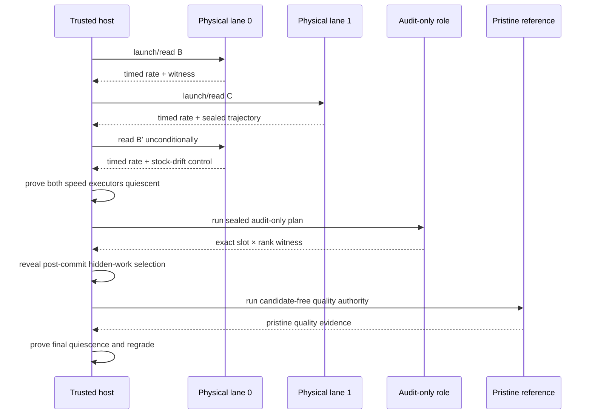

# Authoritative qualification

Qualification asks a narrow question: does one exact submitted delta improve one frozen
evaluation stack, in one registered arena, at acceptable quality?

The production answer comes from the version-3 qualification protocol executed
by a trusted host controller. Every candidate is measured by separate baseline
and candidate engine processes on two isolated TP lanes under one sealed
physical-lane authority. Timed GPU work is
serialized in either case. The answer does not come from a routing screen, local
diagnostic launch, candidate-side self-audit, miner report, or arbitrary
evaluator command.

## Identities before execution

Before a candidate runs, the validator binds:

- finalized reservation and hotkey;
- arena service and workload;
- target catalog and exact singleton or atomic target;
- submitted-delta digest;
- incumbent and candidate `EvaluationStackManifest` digests;
- materialized engine-tree and launch identities;
- model, runtime, topology, native build, seccomp, and worker distribution;
- calibration, resident speed, physical-lane, slot-audit, and graph-verification
  requirements; and
- selection commitment, private selection secret reference, and candidate order.

For a registered candidate, C is the incumbent stack with exactly one target replaced.
Every other contribution, adapter, fallback, and engine setting is supplied by the
validator.

There are three nested identities to keep straight:

| Identity | What it fixes | Why it matters |
|---|---|---|
| Reservation | Finalized arrival, hotkey, publication, target members, submitted delta | Prevents a later file tree or miner from inheriting the attempt |
| Qualification authority | Frozen source/plan, candidate order, selection commitment, arena/calibration/runtime identities | Prevents the evaluator from changing the experiment after admission |
| Contribution identity | Arena, target, delta, hotkey, and exact incumbent/candidate stack and tree digests | Binds the retained measured contribution |

Paths are not identities. Moving the same publication or evidence store does not change
the content digests, while rebuilding “equivalent” source under new bytes does.

## Speed-policy versions

Retained attempts identify the speed policy that created them:

| Version | Timed reads | Purpose |
|---|---|---|
| v10 | B/C/B′, always three | Every cell warmed; both stock reads valid; single-cell median rate |
| v11 | B/C/B′, always three | Every cell warmed; mixed-cell total tokens / total time |
| v12 | B/C/B′, then a one-token prompt pass of each lane; always six | v11 decode rule unchanged; the [prefill lane](#prefill-lane-v12) admits a competitive decode miss at a sealed prompt margin |
| v8/v9 | B/C/B′, always three | Retained historical arithmetic only |

Versions 1–7 were the MiniMax-M3 era's schedules: the adaptive five-read
bracket (v1–v5) and the conditional bookend on the standing resident pair
(v6/v7). Their graders, the legacy `SpeedWitness` lane, and the repeat-quality
leg were deleted on 2026-09-06 with the pair-native lane. No MiniMax-M3
product will be re-run or re-graded, so the runtime, evidence readers, and
settlement refuse a witness below version 8 instead of decoding it. Every
candidate is now measured by the two-process crossover, which launches its own
baseline and candidate engines. That substrate binds v10 (v11 for a mixed-cell
workload, v12 when the commission seals a prefill lane) and reads B′
unconditionally: the quality gate takes its stock-drift control from the second
baseline read, and a conditional bookend leaves a clear PASS with no control to
harvest. Reading it regardless of the outcome also preserves what the
conditional versions enforced — a read taken regardless of a result cannot be a
read taken because of one.

The plan builder stamps the schedule version when the qualification plan is
built, and the worker executes the version the sealed plan carries, so the plan
and the execution substrate cannot disagree. Every calibrated threshold is the
one the provider sealed.

C′ and B″ do not exist under v10, v11 or v12; no code path in this tree reads them.

Fresh execution is resident-only: the runner refuses any other speed-evidence
policy at entry, and the constructor default is the resident policy — the only
one a fresh plan can run. A reopen binds the retained evidence's own policy
explicitly, and retained v8/v9 artifacts regrade byte-for-byte without
reinterpretation. Merely changing the policy label does not upgrade old
evidence.

## Per-cell first-token and decode delivery measurements

A sealed qualification commission can set `session.measure_phase_latency` to
`true`. Omit the field to retain the existing generation protocol. The commission
builder carries this choice into both timed lanes and the workload identity;
the eager audit role and pristine reference remain untimed. Each measured cell
must generate at least two output tokens per request.

The worker streams the same planned requests and sends a first-token and a
final-token boundary for each prompt. The controller timestamps their arrival,
checks their request identity and token IDs against the final evidence, and
retains the relative host times in each timed window's `prompt_latencies`.
Worker-supplied timestamps are never accepted. Missing, duplicate, stale or
inconsistent boundaries are measurement failures, not candidate speed failures.

Each resident read in `speed_witness.rates` then includes a `cells` table grouped
by input tokens, output tokens and request concurrency:

| Field | Definition |
|---|---|
| `mean_ttft_seconds` | Mean time from batch dispatch to each prompt's first delivered token |
| `mean_tpot_seconds` | Mean `(last delivery − first delivery) / (output tokens − 1)` across prompts |
| `end_to_end_output_tokens_per_second` | Cell output tokens divided by its timed batch spans |
| `timed_batches` | Number of retained timed batches for this cell |

TTFT includes queueing, tokenization, prefill, sampling and delivery. TPOT measures
delivery after the first token, including interference from other requests and
stream buffering. A first chunk may contain several tokens. These are serving
latency measurements, not isolated GPU phase durations or pure input-token
throughput. The exact input length and concurrency therefore accompany every
result. Cells are reported separately rather than averaged together.

The dashboard's submission **Performance** section displays these cells with
TTFT and TPOT in milliseconds. It shows **Not measured** for evaluations that
did not collect delivery timings. Output tok/s and the v12 prompt-pass
comparison remain available independently; prompt passes use **prompts/s**,
because each request generates one output token. Their batch durations are not
per-request TTFT. Dashboard display does not enable a measurement mode or
change a qualification verdict.

This option does not change the v10/v11 qualification or payout rule. A 1.5× TTFT
improvement is reported as such, not credited as a 1.5× end-to-end speedup. The
reviewed policy that can qualify a prompt-processing win on its own terms is the
version-12 [prefill lane](#prefill-lane-v12) below; it grades a separate one-token
pass, not these delivery timings.

Enabling measurement requires a fresh commission because the consumed source,
prompt protocol and workload identity change. Drain an active evaluation before
switching; never change its measurement mode midway through B/C/B′. Stage the
updated source and commission inputs first, then validate on the exact
commissioned image, model and TP topology before mainnet activation. The option
adds no model loads, prompt batches or replayed historical evaluations, but its
streaming overhead must be measured on that runtime. Existing reports and
continuations retain their original bytes and remain readable without phase
fields; their missing phase times cannot be reconstructed from aggregate rates.

## Prefill lane (v12)

Version 12 keeps the v11 decode schedule byte for byte and appends a prompt
pass to each lane after B′: `B_prefill`, `C_prefill` and `B_prime_prefill`
replay the same sealed batches with every request budgeted to one generated
token, so each read measures prompt processing with no decode work to dilute
it. The decode reads B/C/B′ are taken first, in the same order and with the
same conditioning as under v11, and the decode verdict is graded first and
alone. A one-token batch is never streamed for first-token and delivery
timing; per-batch `prompt_latencies` stay on the decode reads.

The prompt pass is consulted only when the decode floor neither admitted nor
convicted the candidate:

| Decode grade | Prompt pass | Outcome |
|---|---|---|
| `PASS` | anything | `PASS` on the decode lane; the settled speedup is the decode speedup |
| `FAIL`, candidate slower or conditioning regression | anything | `FAIL` |
| `FAIL`, bar not cleared | clears `prefill_lane.min_margin` against both stock prompt reads | `PASS` on the prefill lane |
| `NO_DECISION`, valid measurement at the boundary | clears the prefill margin | `PASS` on the prefill lane |
| `NO_DECISION`, invalid measurement | anything | `NO_DECISION` |
| any non-`PASS` | does not clear the prefill margin | the decode grade, unchanged |

A decode bundle therefore sees exactly the v11 outcome, whatever its prompt
pass measures. A prefill-lane admission settles at a sealed fraction of the
prompt-pass gain rather than at its raw speedup, because prompt throughput is
not one-to-one with end-to-end serving throughput:

```text
prefill speedup = C_prefill / max(B_prefill, B′_prefill)
settled speedup = 1 + prefill_lane.credit_weight × (prefill speedup − 1)
```

The prompt reads obey the same bracket-validity and window-stability rules as
the decode reads. The witness headline (`initial_verdict`, `final_verdict`)
remains the decode verdict; the settled speedup is what settlement and V1
credit consume, and every earlier witness regrades unchanged under its own
version.

A sealed commission enables the lane with an optional block inside
`resident_speed`:

```json
"resident_speed": {
  "max_stage_seconds": 900,
  "prefill_lane": {"min_margin": "0.05", "credit_weight": "0.33"}
}
```

Both values are canonical decimal strings; the margin must lie in (0, 1) and
the weight in (0, 1]. The block requires a mixed-cell workload, because v12
extends the v11 makespan rule, and a fresh commission: the version, the read
order and both thresholds are part of the sealed policy digest. The pass adds
three prompt-only reads over the sealed batches (two on the baseline lane, one
on the candidate lane) and no model loads, so the sealed stage and
qualification wall bounds must cover them. Validate the exact commissioned
image, model and TP topology before mainnet activation, as for any policy
change.

## Current qualification timeline

The commissioned prompt authority includes a warmup for every declared cell,
with each prompt and its sealed answer expanded together before composition.
The session and hidden judge consume those same batches. Commissioning checks
that the warmup covers every cell and that the remaining counts match the
registered timed reads; it never inserts prompts into only one consumer.

The version-3 protocol binds two non-overlapping physical TP lanes, equivalent
topology, separate runtime namespaces, lane-specific NUMA policy, exact
workload, and a total qualification budget. The baseline and candidate
processes are launched for the request. The controller permits only one lane to
execute timed GPU work at a time.

Every read's evidence carries the engine-observed prompt token count for each request,
and the protocol layer rejects any read whose counts differ from the sealed workload
cell before it can be graded. A nominal host-side token count is never authority, and a
count mismatch is an infrastructure fault — it can hold the leg, never mint a candidate
verdict.



V10 and v11 always read B/C/B′ because the quality stage requires a second stock
observation. C′/B″ are unreachable. The candidate cannot request extra reads. The retained
witness records which reads occurred, lane identities, operational timing, and
the stage and total budgets.

Speed is graded before the expensive audit and pristine-reference stages. An ordinary
speed non-PASS emits a durable stage-exit and does not run audit or T. A separately bound
calibration-observation disposition may continue after a speed failure to collect
diagnostic audit and T evidence, but it cannot crown the candidate.

A speed FAIL names what the round proved, graded with the verdict itself rather than
derived from the bare decision. A bar of 1 + u can only call a candidate slower once
its measured speedup falls below the mirrored bound 1 − u, or a conditioning
regression is measured directly; that failure is `candidate_slower`. A miss inside
the band is `speed_threshold_not_met`: the bar was not cleared, and the candidate was
not measurably slower either. Reports settled before this split carry the retained
coarse code `speed_regression`, which remains valid for them and is never recorded on
a new verdict.

The audit-only role is distinct from both timed lanes. Trusted-host grading imports no
PyTorch and requires the expected slot × TP-rank/PID coverage, minimum call counts, and
absence of retained violations or protocol errors. Live floating-point facts are
canonicalized into stable decimal strings before they enter the durable witness.

The audit role is deliberately a minimum-cost slot-call integrity check, not a
semantic or shape-coverage instrument: it deterministically selects the single
shortest committed prompt (ties broken by prompt digest) and repeats it for the
required minimum call count. Semantic and prompt-dependent coverage belong to the
pristine T reference, which the audit role never replaces. This selection policy is
pinned by a regression test; changing it is a reviewed policy decision, not a
tuning knob.

T remains untimed and candidate-free. The host owns role assignment, monotonic clocks,
token numerators, conditioning windows, absolute deadlines, device observations, audit
grading, selection entropy, and teardown. Candidate wall-clock reports and aggregate
throughput are ignored.

## Cohorts and selection

A service may freeze one incumbent and qualify a chain-ordered cohort `C1..Ck`, sharing
bookends and one pristine reference lifetime where the policy permits. This is an
operational optimization, not a semantic relaxation:

- every C remains one exact marginal delta;
- candidate ordering is sealed in finalized cohort/plan order before entropy is observed;
- post-commit entropy selects the hidden prompt/task work, and the selection receipt binds
  that choice without reordering candidates;
- drift outside calibration produces `NO_DECISION`; and
- retained evidence must still support each candidate independently.

The contract does not require cold model loads for every timed read. It requires resident
lane identity, serialized execution, read order, audit authority, and pristine-reference
authority to remain causally and cryptographically separable.

For registered cohorts, a recognized cohort-level factory, runner, raw-speed,
outer-session, or OCI-backend failure that the intake boundary normalizes into a
qualification failure product produces `NO_DECISION` for every affected reservation and a
persisted bisection plan. Subsequent passes halve the cohort to isolate a poisoning or
resource-sensitive candidate in logarithmic retry groups. A per-candidate `NO_DECISION`
after a complete shared attempt is requeued individually. Other provider, controller, or
evidence-publication exceptions abort the pass and recover through controller
restart/hold handling rather than this typed batch product. Neither mechanism changes
finalized arrival order.

A typed candidate-worker error is attributable only when rank receipts bind the exact
registered singleton arm and identity. It publishes a terminal candidate failure product
instead of entering the generic retry path. Baseline-lane, shared-controller, audit/T,
multi-candidate, or untyped worker failures are infrastructure authority failures; they
are never assigned to a convenient candidate.

## Gates and three-way decisions

Qualification reopens and grades several evidence products:

1. **Execution:** required roles completed under the expected launch and device state.
2. **Graph verification:** required target members, variants, shapes, capture, and replay
   have complete evidence.
3. **Speed:** C beats the policy-required B or B/B′ comparison and
   noise-derived bar.
4. **Audit:** the sealed audit-only plan has complete exact slot × rank authority.
5. **Quality:** pristine T validates sealed trajectories and hidden work under the
   registered calibration.
6. **Whole-stack identity:** the report still describes the frozen incumbent and exact
   candidate stack.

The result is one of:

- `PASS` — all required evidence is complete and green;
- `FAIL` — attributable candidate evidence violates a registered requirement; or
- `NO_DECISION` — infrastructure, drift, missing authority, or incomplete evidence makes
  a fair result impossible.

`NO_DECISION` is retryable under bounded policy. It is not a loss and must not be
converted to zero reward for convenience.

The evidence-to-verdict mapping is fail closed:

| Observation | Decision | Example |
|---|---|---|
| Complete, bound, and green across every required product | `PASS` | C clears calibrated speed bar; graph and pristine quality pass |
| Complete attributable violation of a frozen candidate requirement | `FAIL` | Wrong output, graph replay failure, or measured quality regression |
| Authority incomplete, stale, unreopenable, too noisy, timed out, or infrastructurally invalid | `NO_DECISION` | Missing evidence bytes, baseline drift, controller/worker failure |

An unexpected exception is not evidence of candidate guilt. The intake projection turns
recognized plan, runner, and raw-speed authority failures into typed failure products and
retry plans. Other controller exceptions are contained by the pass loop and recovered
conservatively on restart.

### Resident execution evidence

A resident lane is launched stock and acquires candidates by hot-swap, so registering a
slot is the only thing a swap by itself proves. Registration is not execution: a bundle
can load, register its slot, capture, and then never dispatch, and such a run still
produces a complete speed number.

Each swap therefore reports per-rank execution evidence for the generation it closes —
the scope is final only once the lane has swapped away from it. A resident candidate leg
is screened or graded only when every rank fired and completed the candidate under exactly
the activation generation. A rank that fell back to the trusted baseline, or failed to
load the bundle, does not count as having executed it.

The reported count is a tri-state, and the states carry different authority:

| Reported | Meaning | Decision |
|---|---|---|
| Unobserved | The evidence path itself is unusable | Infrastructure HOLD / non-verdict |
| Observed, short of the rank group | The candidate did not execute on every rank | HOLD / non-verdict |
| Observed, complete | Execution is proven for that generation | Speed evidence may be graded |

Unobserved is never read as zero. Absent or incomplete evidence may not be
converted into candidate PASS or FAIL. The durable store represents this as a
reservation HOLD with no candidate decision, which is semantically
`NO_DECISION` without reviving the retired literal decision field.

Collective graph qualification requires the sequence cases generated by the
verifier's applicable shape domain. A single applicable shape retains its
individual graph capture/replay check; temporal shape transitions require at
least two distinct token counts, and a graph sequence requires at least two
applicable shapes. A missing required sequence remains a HOLD. Graph-provider
HOLD responses retain the exception type and a bounded cause chain in the
existing failure fields, shown in the dashboard's evaluation forensics.

This evidence is written from inside the candidate's own process. It closes
accidental non-invocation as a verdict condition, but it is not proof against a
deliberate forger; complete-engine isolation and external qualification remain
the boundary.

## Qualification acceptance

One complete audited PASS becomes `qualified` and creates a `SettlementCandidate`
in the same intake transaction. Settlement reopens the exact retained attempt,
report, disposition, graph, audit, and quality evidence. No second qualification
is scheduled.

New single-run candidates use `cacheon.settlement.candidate.v5` and encode only
`primary`. Their existing evidence record uses `cacheon.settlement.evidence.v2`
and omits reproduction fields. Historical paired records keep their exact wire
bytes, distinct-authority and lane-swap checks, and lower accepted speedup.
A complete primary PASS left in `reproduction_pending` by an older controller
is accepted on restart after its evidence reopens; GPU work is not repeated.

## Reopen and regrade

Full regrade requires more than the persisted attempt reference. The caller must
reconstruct the exact `CausalQualificationInput`, including prepared plans, candidate
authorities, graph/calibration references and requirements, runtime policy, reference
authority, and commitment. SQLite's authority manifest and
`CohortQualificationAttempt` bind identities but do not embed that complete private
provider/plan object. Settlement restart authenticates attempt bytes and stored PASS
dispositions; it does not invoke the full causal regrader.

The final report is derived from the serialized attempt, referenced graph/quality
artifacts, and calibration manifests. Reopen can regrade graph and raw quality evidence.
Speed regrading uses the retained `ResidentSpeedWitness`, which retains the
v10/v11 B/C/B′ schedule, physical-lane authority, operational timings, and
budget. A witness below version 8 is sealed MiniMax-M3 history and is refused
rather than decoded. Regrading recomputes rates and the frozen
decision from those typed facts; it does not reconstruct them from raw session
frames. A summary JSON line without these products is not authority.

See [Evidence and replay](../security/evidence.md) for retention and audit requirements.

An authoritative attempt is not one headline. Durable authority includes the authority
manifest; selected plan and commitment/entropy/selection receipts; referenced graph
evidence; the aggregate speed witness; the pristine-T execution
witness and raw quality artifact/binding; per-candidate reports; and the enclosing attempt
artifact. Settlement keeps every accepted attempt reference.

The live outer session validates richer per-read protocol frames, lifecycle order, device
state, and cleanup before constructing that attempt. Those raw frames and per-arm device
samples are not serialized into `CohortQualificationAttempt`. The aggregate speed witness
must not be documented as raw batch retention or as proof that a later audit can replay the
original timing frames.

Reopening verifies hashes and expected bindings before grading. If the attempt artifact
reopens but a referenced graph, calibration, or raw quality product does not, authority is
still incomplete. Operators must retain every referenced evidence-store object and test
restores, not merely archive the final report digest. If policy requires raw B/C/B′ frame
replay, the attempt schema must first be extended to retain and bind those products.

## Qualification incident handling

| Incident | Required disposition |
|---|---|
| Candidate engine exceeds deadline or violates protocol with attributable evidence | Grade under the frozen requirement; `FAIL` only when attribution is complete |
| Typed worker failure binds one exact candidate arm | Contain that candidate; retain its attributable outcome and preserve unaffected cohort results |
| Recognized worker, Docker, GPU, driver, plan, runner, or raw-speed authority failure | `NO_DECISION`; repair infrastructure and use bounded retry |
| Evidence-store publication failure | Abort the pass; recovery holds an interrupted `qualifying` row as `controller_restart_during_qualifying` rather than manufacturing a typed `NO_DECISION` |
| Baseline drift exceeds calibration | `NO_DECISION`; do not increase the candidate's denominator or tune the bar after seeing C |
| Either resident speed executor survives past its quiescence proof | Abort authority; never launch audit or T into the contaminated lifetime |
| Audit role misses a slot/rank, reports a violation, or cannot reopen | `FAIL` only for a complete attributable violation; otherwise `NO_DECISION`; never substitute candidate-side audit output |
| T identity/session mismatch | `NO_DECISION`; T cannot be replaced with B′ or a candidate-side audit |
| One member poisons a registered cohort | Preserve cohort failure digest and execute the stored bisection groups |
| Accepted PASS evidence root lost | No settlement; restore exact bytes or hold |
| Historical reproduction differs in contribution identity or reuses an independence digest | Reject the retained pair; do not reinterpret its original contract |

Never rerun only the favorable arm, splice evidence from different authorities, or lower
a threshold after seeing the outcome. A fresh attempt must be a complete, newly bound
qualification under the registered policy.

## Standing two-lane composition and remote products

The commissioned deployment surface for standing mainnet qualification lives in
`eval/b300_qualification_deployment.py` and `eval/b300_registered_qualification.py`.
Registered per-target profile authorities are sealed ahead of time; at plan time the
deployment layer independently re-derives the profile authority for the finalized
reservation and rejects a plan whose authority, marginal arm, secret, pristine
binding, or resident lane executors differ from the sealed construction inputs. The
two resident TP4 lanes are carved from the one commissioned eight-B300 pod, and the
physical lane pair, device identities, and role swap are validated against the READY
receipt before any engine work.

Remote execution of qualification returns a sealed `RemoteQualificationProduct` under
remote-evaluation protocol schema version 2: size-bounded evidence artifacts are
rehashed on capture and on import, and the coordinator's durable
`commit_remote_qualification_result` pins the incumbent stack and tree identity per
arena on first commit and rejects any later mismatch atomically. Transport,
authentication, and identity-check failures release the durable lease as
infrastructure outcomes; they are never converted into a candidate verdict.

The persistent production consumer is
`eval/b300_remote_worker_adapter.py`. In `--serve` mode it loads one
digest-exact qualification-capabilities factory, calls
`build_commissioned_b300_qualification_service`, and derives both the screen
worker and qualification commission from the same registered READY authority.
Each authenticated qualification request resolves its closed promoted cohort,
derives a candidate-local `B300RemoteQualificationAdapter`, and runs through
`B300MainnetWorker.run_remote_qualification`. Screen-only construction and
one-shot adapter mode still refuse qualification before resident work.

Registered B300 qualification seals only the canonical retained-support policy
digest derived by `retained_support_policy_digest()`. A stale support-policy
digest fails commissioning before GPU execution; retained quality validation
checks the same binding again after execution.

The commission measures B against the durable incumbent stack the
capabilities factory declares (`incumbent_entries`, resolved through the same
closed source resolver); at genesis the declaration is empty and the baseline
is the stock tree. The two-process schedule's baseline process boots the
materialized incumbent tree, and the worker executes the sealed version the
plan carries, so plan and execution cannot disagree. Pristine T stays anchored
to the empty stock stack regardless of the declared incumbent, so the untimed
audit reference never inherits crowned contributions. A declaration that does not reproduce the
durable stack identity fails closed at the dispatcher's incumbent pin and at
the durable commit. Screens keep the stock baseline: the resident hot-swap
screen is routing-only and cannot crown.

`eval/crossover_runtime.py` owns qualification planning and scoring for the
two-process schedule. Deployment-private capability bytes still supply sealed
identities and must match their configured source digest; they do not create a
second evaluator.

## Nonclaims

- Passing proves the registered arena/workload and policy, not universal model quality or
  performance.
- T is an independent semantic reference, not proof that the reference implementation is
  bug-free.
- Isolation and protocol checks reduce candidate influence; they are not a formal proof
  against GPU, driver, kernel, or container-runtime compromise.
- A crown records measurement and attribution. It does not satisfy integration, license,
  provenance, maintainability, or release review.
- Deployment must supply a reviewed production provider that constructs this work for the
  registered arena. Structural qualification fixtures can test the authority path but cannot
  establish an empirical GPU crown or production calibration.

Next: [Settlement and weights](settlement-and-weights.md).

## Source anchors

- [Qualification evidence model](https://github.com/latent-to/cacheon/blob/main/cacheon/eval/qualification.py)
- [Causal qualification runner](https://github.com/latent-to/cacheon/blob/main/cacheon/eval/qualification_runner.py)
- [Resident crossover runtime](https://github.com/latent-to/cacheon/blob/main/cacheon/eval/crossover_runtime.py)
- [Qualification deployment composition](https://github.com/latent-to/cacheon/blob/main/cacheon/eval/b300_qualification_deployment.py)
- [Registered qualification profiles](https://github.com/latent-to/cacheon/blob/main/cacheon/eval/b300_registered_qualification.py)
- [Remote qualification adapter](https://github.com/latent-to/cacheon/blob/main/cacheon/eval/b300_remote_qualification_adapter.py)
- [Torch-free audit gate](https://github.com/latent-to/cacheon/blob/main/cacheon/audit_gate.py)
- [Finalized-intake projection](https://github.com/latent-to/cacheon/blob/main/cacheon/eval/qualification_intake.py)
- [Pristine reference session](https://github.com/latent-to/cacheon/blob/main/cacheon/eval/oci_reference_session.py)
- [Qualification tests](https://github.com/latent-to/cacheon/blob/main/tests/test_qualification_runner.py)
