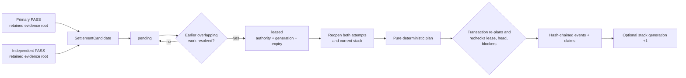
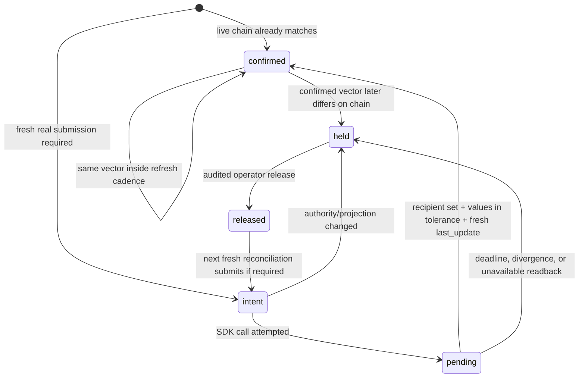

# Settlement and weights

Settlement changes the evaluation incumbent. Weight publication projects settled reward
claims onto the live metagraph. They are separate operations with separate authority.

Miners looking for the participant-facing lifecycle should start with
[How miners earn rewards](../miner-guide/incentives.md). This page is the validator
operator runbook for settlement, signing, publication, and recovery.

`chain-validate` may perform settlement when a trusted arena service is injected, but it
never opens a wallet or calls a chain weight API. Legacy V1 publication uses
`cacheon set-weights`.

The separation prevents a long-running evaluator from becoming a signer and prevents a
chain SDK return value from mutating evaluation-stack authority. Both operations use the
same exclusive SQLite store at different times, so deployment must coordinate ownership:
finish or pause a validator pass, run the signer reconciliation, close the store, and
resume. A lock collision is a control-plane scheduling error, not a reason to remove the
lock file.

## Settlement inputs

`SettlementCandidate` requires two complete passing qualifications:

- a primary attempt; and
- an independent reproduction of the same arena, target, delta, hotkey, incumbent, and
  challenger identity.

The attempts must use distinct qualification authority and evidence. The candidate's
settlement speedup is the lower of the two measured speedups.

A completed PASS carries across a source-only recommission when runtime, engine,
catalog, incumbent entries, candidate entries, selected delta, and speed policy are
unchanged. The prior measurement and authority remain intact while only the new
commission-derived arena, stack/tree, and physical-lane labels are adopted.

Each production version-3 attempt runs its sealed speed subpolicy — current v7
resident B/C with conditional B′ or current v8 two-process B/C/B′ — followed by
registered eager audit A and pristine T when required. For reproduction, the
baseline and candidate physical TP-lane orientations must exact-swap. The
speed-policy and settlement-control digests remain equal; fresh process names
on the same lane orientation do not satisfy independence.

Settlement planning is pure: it receives typed candidates plus the exact current
`EvaluationStackManifest` and tree digest. It reads no database, chain, wallet, or mutable
host state.

## From two PASSes to one atomic commit



The store chooses the oldest economically unblocked group sharing one qualification
authority. Earlier unresolved reservations that overlap the candidate's target members
remain blockers; a later fast result cannot jump them. The default lease is 30 blocks.
Expiry returns it to pending with a higher lease generation, preventing a worker holding
the old lease from committing.

The controller reads a fresh finalized height immediately before requesting each lease
and refuses a regressed clock. It refreshes the height again immediately before commit.
Inside the transaction the store verifies that the lease has not expired, the incumbent
stack and event-journal head have not advanced, economic blockers have not changed, both
retained evidence products are still byte-identical, and the plan exactly equals a
freshly recomputed plan. Any disagreement aborts the transaction. A pass with no pending
settlement work does not make these extra finalized-height reads.

Lease expiry is not arena retirement. Intake reservations have explicit `release_hold`
and minimum-age `expire` transitions. Eligible unresolved rows also expire automatically
against the finalized arrival/progress-block SLA; active in-flight work and the dedicated
schema-3 migration hold are excluded. This row-level expiry is not a generic wall-clock
TTL or a typed transition that retires an entire arena. Before a valid explicit or
automatic disposition, held state can block later overlapping work; deleting rows is not
a recovery mechanism.

## Deterministic plan

Candidates naming an older incumbent are held as `stale_incumbent`. Discovery candidates
produce bounty events without changing the stack. Among current registered candidates,
the planner chooses the highest conservative speedup and uses finalized order as a stable
tie-break.

Staleness is judged per target lineage, not only against the planning arena's own stack.
`arena_digest` is derived per commissioned baseline, so a challenger graded against a
superseded incumbent is commissioned into a *different* arena whose own stack is that old
baseline. The per-arena `incumbent == before` test alone therefore passes and crowns it a
second time for one target. `target_lineage_tips` records the artifact holding each
target's active root-to-tip lineage, each parent artifact, and each conservative winning
speedup. A candidate measured against any ancestor remains eligible when its reservation
was already present when the active lineage first left that ancestor and its conservative
speedup is strictly greater than the product of every winning edge from that ancestor to
the current tip. For example, with `A -> B -> C`, a candidate `D` measured on A must beat
`(B/A) * (C/B)`. Equality does not pass. If D wins, the active lineage becomes `A -> D`;
D is the next baseline and the old `B -> C` branch remains auditable history.

A later reservation against an old ancestor, a candidate based on an artifact outside the
active lineage, or a score at/below the composed threshold is held `stale_incumbent`.
Retained qualification evidence is not deleted or recomputed merely because the active
tip advanced.

Each CROWN snapshots the reservation IDs present in intake; this is the temporal authority
for the exception and avoids ambiguous same-block comparisons. Stores that settled before
this ledger existed are seeded once with `cacheon chain-backfill-lineage`, which rebuilds
the ledger from the newest recorded crown per target and is idempotent. Historical journals
did not retain a transition-time snapshot, so the backfill conservatively marks only
reservations no later than the winning submission itself as provably pre-transition. The
lease's tips and eligible reservation set are rebound to durable state inside the commit
transaction because the expected plan is recomputed from the lease's own authority.

The hash-chained event journal can contain:

| Event | Meaning |
|---|---|
| `HOLD` | Candidate cannot advance against this incumbent or lost a conflict |
| `CROWN` | Passing marginal contribution is recognized |
| `RETIREMENT` | Previous contribution at the target is superseded |
| `NEUTRALIZATION` | An overlapping target is displaced by explicit catalog policy |
| `ADOPTION` | New contribution is inserted into the evaluation stack |
| `STACK_TRANSITION` | Incumbent stack/tree advances atomically |
| `DISCOVERY_BOUNTY` | Qualified discovery receives bounded bounty treatment only |

The SQLite store leases an economically unblocked cohort, reopens the exact evidence and
current stack, and applies the event journal, stack transition, candidate dispositions,
standing claims, and discovery claims in one transaction. A failed transaction does not
partially crown a candidate.

The event journal is append-only and digest chained. Event types have distinct jobs:

- `CROWN` recognizes the winning measured contribution and creates the active standing
  claim for its registered target.
- `RETIREMENT` deactivates the previous claim for the same target.
- `NEUTRALIZATION` deactivates explicitly overlapping target families according to the
  catalog, not manifest order.
- `ADOPTION` and `STACK_TRANSITION` record the exact new evaluation manifest/tree and
  advance its generation together.
- `HOLD` records stale rows and every current registered non-winner without mutating the
  stack: stale-incumbent rows use `stale_incumbent`, overlapping losers use
  `conflict_lost`, and non-overlapping current losers use `incumbent_advanced` because the
  winning transition advanced the shared incumbent.
- `DISCOVERY_BOUNTY` creates only the bounded discovery claim; it has no stack transition.

Do not infer event meaning from a miner bundle name or the final row status. Reopen the
event, candidate pair, evidence receipt, and resulting stack state as one authority.

## Legacy V1 CROWN rewards

Two independently bound PASSes make a contribution eligible for settlement; they
do not make it an earning claim. Only the settlement `CROWN` earns. When that
transition advances the incumbent, existing reservations keep their durable queue
baseline. Qualification drains the contiguous old-baseline segment in finalized
arrival order under the still-resident commission. Settlement may use the
pre-transition ancestor rule above, but it never erases a completed evaluation just
because the tip changed.

The evaluator requests recommission only when the oldest active queue segment is
bound to a different stack. The boundary is checked before a qualification lease,
request publication, or GPU action. Screening can continue because it is not
baseline-relative. After recommissioning, the next segment runs against its own
persisted stack; one qualification cohort can never mix stack segments. A completed
remote product that differs from the baseline assigned to its own lease is still
released through a digest-bound stale-incumbent recovery event because that is an
execution-authority mismatch, not a normal queue transition. The projector derives
crown history from retained settlement candidates and qualification evidence rather
than a second reward table.

Credit uses logarithmic speedup, a submission-time stall multiplier, and
exponential half-life decay as defined in
[Legacy V1](../reference/emissions-policy.md#legacy-v1). The existing
`crowned_block` wire field carries the finalized submission block for compatibility;
evaluation delay cannot reset reward age. Duplicate packaging earns once.

## Legacy V1 discovery bounties

Discovery does not install an evaluation stack entry. A qualifying discovery may create
one non-renewable claim with a bounded lifetime. All live discovery claims share a policy
pool measured in ppm; standing families receive the remaining pool. Repackaging,
promotion, integration, or release cannot renew the same bounty.

## Legacy V1 global projection

The reward builder reopens every retained crowned PASS pair plus the active stacks
and standing claims, then binds:

- chain genesis scope and netuid;
- validator hotkey;
- policy digest;
- effective block and block hash;
- current metagraph membership;
- arena stack generations and evidence; and
- an exact, positive integer-ppm vector satisfying the normative
  [Legacy V1](../reference/emissions-policy.md#legacy-v1) total.

Missing or corrupt PASS/standing evidence holds the complete projection. An absent
claimant's share goes to the validator for that tick and returns if the claimant
re-registers.

Projection starts from an exact finalized metagraph context. Immediately before signing,
the reconciler refreshes finalized authority. A later finalized height is acceptable only
when the validator UID and every weighted recipient UID remain unchanged. Reassignment
before signing aborts publication; reassignment after submission prevents confirmation
and retains a hold. The journal still represents several finalized reads rather than an
atomic substrate transaction, so confirmation depends on the retained chronology and
exact vector readback.

Projection is global, not one `set-weights` call per target. Generation-zero arenas
may contribute retained PASS history but do not become active stack authorities. The
builder projects every crowned stack under the live reward catalog and binds the policy
digest. A crowned stack carries the catalog snapshot it was sealed under; the projection
refuses that stack when the sealed and live catalogs differ in reward-relevant policy
(target identity, structure, contracts, or composition rules). Admission policy
(`allowed_features`) and sections outside `targets` and `composition_rules` may differ
without re-crowning, so retiring an admission lane does not orphan crowned arenas.
The v1.1/v1.3/v1.4 bindings advance to v1.5 only with identical numeric policy
fields; unrelated policy changes remain refused.

A retained pair earns from the lower of its two settled speedups, and that ratio
is only as good as the baseline lane behind it. When the retained stage-exit
artifacts show that the credited half read the baseline lane under the arena
band (the median of every retained baseline-role read in the arena minus five
percent, over at least six reads), the operator command
[`chain-reopen-qualification`](../reference/cli.md#chain-reopen-qualification)
returns the pair to the screen queue for a fresh independent pair against the
current incumbent and archives the old candidate under `settlement_reopenings`.
The pair stops earning the moment it leaves `qualified`. A reopened row binds
to the stack whose service re-screens it, not the stack current at its original
arrival, so it never parks the queue behind a retired commission. Crowned or
otherwise settled candidates are lineage and cannot be reopened this way.

## Dry run

Use the same policy values intended for the deployment:

```bash
cacheon set-weights \
  --intake-db chain_intake/intake.sqlite3 \
  --netuid <NETUID> \
  --network <NETWORK_OR_WSS_URL> \
  --wallet default \
  --hotkey validator \
  --half-life-blocks <BLOCKS> \
  --discovery-lifetime-blocks <BLOCKS> \
  --discovery-pool-ppm <PPM> \
  --refresh-blocks <BLOCKS> \
  --dry-run
```

Dry run refreshes the live metagraph and exercises projection/reconciliation, but it does
not pass a wallet to the reconciler, sign or submit an extrinsic, or create a publication
journal intent. A normal real submission requires at least one genuine current-schema
crown; the explicit all-uncrowned burn projection below is the only bootstrap exception.

### All-uncrowned burn projection

Normal projection deliberately refuses to invent a reward owner while nothing is
crowned. An operator can explicitly route the complete bootstrap vector to one registered
burn hotkey:

```bash
cacheon set-weights <POLICY_AND_SIGNER_ARGUMENTS> \
  --burn-hotkey <REGISTERED_BURN_HOTKEY> \
  --dry-run
```

This projection is valid only with no active standing/discovery claims, no crowned arena,
and no activated V2 composition. The burn hotkey must belong to the exact finalized
metagraph. Any real economic authority disables the path.

### Subnet-owner burn bootstrap

`--burn-to-subnet-owner` is the chain-resolved variant of the all-uncrowned
bootstrap. It resolves the subnet owner coldkey from the finalized metagraph
RuntimeAPI, selects one owned UID (prefer `SubnetOwnerHotkey`, else lowest
UID), and publishes `{hotkey: 1.0}` through the same durable
intent → pending → confirmed/held journal as every other publication, with
`require_current_crown=False`. Like `--burn-hotkey`, it refuses the moment any
active standing/discovery claim, crowned arena, or activated V2 composition
exists in the intake database, and it refuses a foreign in-flight journal
head. Its own in-flight head — same chain scope, signer, policy, and burn
vector under an earlier block-bound digest — is resumed through the journal
instead: confirmed by authoritative readback once the publication lands, or
carried as `pending` inside its retry bounds, so a refresh submission that
outlives one tick does not stop the watch. The refusals are non-retryable, so
a `--watch` loop stops with a typed error at the first CROWN — restart
without the flag to publish settlement weights. Emissions policy flags and `--intake-db` are required. It is
incompatible with `--burn-hotkey`, `--reconcile-only`, `--release-hold`, and
weight-offer / object-store publish, and it never publishes shared weight
offers.

```bash
cacheon set-weights \
  --burn-to-subnet-owner \
  --netuid <NETUID> \
  --network <NETWORK_OR_WSS_URL> \
  --intake-db <PRIVATE_DB_PATH> \
  --half-life-blocks <BLOCKS> \
  --discovery-lifetime-blocks <BLOCKS> \
  --discovery-pool-ppm <PPM> \
  --refresh-blocks <BLOCKS> \
  --wallet default \
  --hotkey validator \
  --dry-run
```

## Publication journal

Real publication is fail-closed and journaled:

| State | Meaning |
|---|---|
| `intent` | Exact projection persisted before the SDK call |
| `pending` | Submission attempted, but authoritative chain confirmation is absent |
| `confirmed` | The exact recipient set, normalized values within the fixed verifier tolerance, and a sufficiently new `last_update` were read back |
| `held` | Authority changed, deadline expired, readback diverged, or post-submit state is unavailable |
| `released` | Operator appended an audited release of a retained hold |

The chain helper checks the SDK response's `success` field (or the older tuple form), so
a call may return without raising and still report `submitted=False`. Even
`submitted=True` is not confirmation. The reconciler refreshes the metagraph immediately,
maps recipients to current UIDs, reads current validator weights, persists intent before
signing, and confirms only when the chain has the exact recipient set, each normalized
value is within the fixed `2e-5` relative/absolute verifier tolerance, and `last_update`
is new enough.

The normal state transitions are:



`pending` is a valid unresolved result, not success. Before its retry block, another run
only observes it. At or after the deadline, absent matching readback becomes `held` rather
than blindly resubmitting.

On every non-dry invocation, `set-weights` and `follow-weights` resume any retained
`intent` or `pending` projection before adopting a new one. Chain scope, netuid
and signer must still match. A refreshed offer cannot replace an in-flight vector.
An authority mismatch or a direct low-level call bypassing resume fails closed.

The reconciler can confirm a preexisting chain match without signing. It refuses
a real submission with zero `crown_count`, a different signer, or stale authority.

If the journal is held, investigate and preserve the record. To append an audited release
without submitting:

```bash
cacheon set-weights \
  --intake-db chain_intake/intake.sqlite3 \
  --netuid <NETUID> \
  --network <NETWORK_OR_WSS_URL> \
  --wallet default \
  --hotkey validator \
  --half-life-blocks <BLOCKS> \
  --discovery-lifetime-blocks <BLOCKS> \
  --discovery-pool-ppm <PPM> \
  --refresh-blocks <BLOCKS> \
  --release-hold "reviewed reason"
```

Then run the normal command again so it refreshes all live authority. `--release-hold`
cannot be combined with `--dry-run`.

Releasing a hold does not approve the old vector or submit it. It appends a `released`
record with the operator reason. The next normal invocation rebuilds and refreshes all
authority before deciding whether a new intent is valid.

### Continuous V1 reconciliation

The signer can own a continuous control-plane loop:

```bash
cacheon set-weights <POLICY_AND_SIGNER_ARGUMENTS> \
  --watch \
  --interval <SECONDS>
```

Each iteration refreshes complete authority. The loop retries bounded retryable
transport/chain failures and stops on nonretryable publication faults. Watch mode rejects
`--dry-run`, `--reconcile-only`, and `--release-hold`; signer-free inspection remains a
deliberate one-shot operation.

### Shared current-weights endpoint

Roles are split so the **eval host never publishes weights on-chain**:

1. **Eval** builds a `CurrentWeightOffer` around the legacy V1
   `WeightProjection` and **PUTs** it to `serve-weights` with rotatable HMAC
   credentials (`push-weight-offer`).
2. **Cheap `serve-weights`** persists the offer (object store or local file),
   accepts authenticated push, verifies the persisted push envelope, and serves
   permit-gated `GET /v1/current-weights`.
3. **Follower validators** fetch the offer, rebind the signer hotkey, and
   publish via the same commit-reveal reconciler (`follow-weights`). The
   signer-only journal does not require a replica of evaluator economic
   state.

Offer production must survive an evaluation pause: `follow-weights` refuses a
projection older than its refresh window, so an offer that stops being re-minted
while the standing supervisor is down freezes the chain vector. The standalone
producer, `python -m cacheon.chain.weight_offer_service --config <sealed offer
config>`, composes the supervisor's weights stage against the same sealed screen
and weights authorities on a loop, pushes to `serve-weights`, and never signs.
Exactly one producer runs per intake database: while it is armed, the standing
supervisor's `enable_weights` stays false.

```bash
# one-time on the gateway host: dedicated HTTP authority (not a chain signer)
cacheon mint-weight-gateway \
  --wallet-path /var/lib/cacheon/wallets \
  --wallet gateway \
  --hotkey authority \
  --push-credentials /secret/push-credentials.json

# cheap host (object store + push enabled)
cacheon serve-weights \
  --object-store-provider hippius \
  --object-store-bucket cacheon-weights \
  --object-store-prefix sn307 \
  --push-credentials /secret/push-credentials.json \
  --netuid <NETUID> \
  --network <NETWORK_OR_WSS_URL> \
  --wallet gateway \
  --hotkey authority \
  --wallet-path /var/lib/cacheon/wallets \
  --host 0.0.0.0 \
  --port 8080

# eval host: build offer + HTTP push only (no chain wallet / set_weights)
cacheon push-weight-offer \
  --intake-db chain_intake/intake.sqlite3 \
  --netuid <NETUID> \
  --network <NETWORK_OR_WSS_URL> \
  --url http://weights-gateway:8080 \
  --push-credentials /secret/push-credentials.json \
  --attribution-hotkey <PLACEHOLDER_SS58> \
  --half-life-blocks <BLOCKS> \
  --discovery-lifetime-blocks <BLOCKS> \
  --discovery-pool-ppm <PPM>

# signer validators: GET + on-chain publish
cacheon follow-weights \
  --url http://weights-gateway:8080 \
  --journal-db chain_intake/follow_weights.sqlite3 \
  --netuid <NETUID> \
  --network <NETWORK_OR_WSS_URL> \
  --wallet default \
  --hotkey follower \
  --refresh-blocks <BLOCKS> \
  --expected-authority <WEIGHTS_GATEWAY_HOTKEY> \
  --watch
```

Rotate credentials with `mint-push-credentials --retire-active` (add a new active
secret, retire the old id, reload serve). Eval can also inject a single active
secret without a file via `CACHEON_WEIGHT_PUSH_KEY` (optional id:
`CACHEON_WEIGHT_PUSH_CREDENTIAL_ID`, default `env`), or point at a credentials
JSON with `CACHEON_WEIGHT_PUSH_CREDENTIALS`. Precedence: `--push-credentials` →
file env → inline key. Swap object-store providers without code
changes: `--object-store-provider s3|minio|local` (and endpoint/region/credentials),
or `CACHEON_OBJECT_STORE_*`. `CACHEON_OBJECT_STORE_PROVIDER` activates an
environment-only configuration; explicit command flags take precedence.
Install the optional client with
`pip install -e ".[object-store]"` (boto3, Apache-2.0).

`GET /v1/current-weights` requires a request signed by the caller's hotkey over a
fresh timestamp; the server checks live `validator_permit` and returns an
authority-signed body. `PUT /v1/current-weights` accepts only active push
credentials. The accepted offer is stored inside an HMAC envelope binding the
credential id and exact offer digest. A push-enabled server verifies that
envelope before it signs a GET response, and the push client requires a fresh
HMAC-authenticated acknowledgement of the request timestamp, credential,
offer, and projection digests. A network intermediary or storage writer
without a retained push secret can cause unavailability, and a storage writer
can replay an old valid envelope, but neither can manufacture a successful
push acknowledgement or a new gateway-authenticated vector. Valid-envelope
replay is additionally bounded by follower freshness and the follower's
monotonic publication journal.

`follow-weights` pins the response authority. When `--expected-authority` is
omitted it resolves and pins the current subnet-owner burn hotkey from the
finalized metagraph (same selection as `--burn-to-subnet-owner`). Pass an
explicit ss58 when the gateway signs with a dedicated non-owner key.
`follow-weights` permits initial catch-up only when the offer is no more than
`--refresh-blocks` behind the live finalized metagraph and the signer and every
weighted recipient retain their UIDs. Its dedicated
`followed_weight_publications` journal accepts both V1 and V2 offers, refuses
block rollback, same-block equivocation, signer changes, and V2-to-V1 lane
regression, and should be one database per signer. Retryable object-store or
gateway failures remain retryable through HTTP `503`.

When `serve-weights` is deliberately run without push credentials, raw local
or object-store bytes are an operator-trusted source; the gateway cannot prove
eval provenance for that mode. A combined `set-weights` / object-store upload
path remains available for legacy single-host signers. It publishes only after
a live reconciliation returns `pending` or `confirmed`, never after dry-run,
reconcile-only, or a hold, and completes the remote current-pointer write while
the exclusive publication journal is still locked. It is not the eval push
path.

## Finite-debt V2

The V2 finite-debt publication surface (signer-free shadows, wallet-free
activation, and `set-debt-weights`) was extracted from the tree on 2026-08-09
without ever being activated. Legacy V1 is the only publication lane. The
retained design intent and the reserved durable schema are described in
[Emissions policy](../reference/emissions-policy.md#finite-debt-v2).

## Failure and recovery matrix

| Condition | Safe outcome | Recovery |
|---|---|---|
| Earlier overlapping reservation unresolved | Candidate remains settlement-pending | Resolve earlier finalized work; do not reorder or delete it |
| Candidate names old incumbent | `HOLD` event / stale-incumbent disposition | Keep its retained evidence; do not rerun it solely because the tip advanced |
| Lease expires or store/journal head advances | Commit aborts; expired lease returns pending | Reopen authority and obtain a new lease generation |
| Either PASS evidence root cannot reopen | No settlement and no reward projection | Restore exact content-addressed bytes or retain hold |
| Transaction fails mid-plan | SQLite rollback; no partial events/claims/stack | Diagnose, then rerun against unchanged authority |
| Valid active claimant is absent from the metagraph | That family's allocated ppm is sent to the validator hotkey for this tick; other family allocations remain unchanged | Investigate membership; if the claimant returns, the next projection pays its then-current decayed share |
| Initial projection is stale, post-read is unavailable, block/`last_update` chronology is impossible, or recipient/vector readback differs | Projection is rejected or publication is held | Refresh authority and reconcile again; do not infer a general membership-churn comparison that the reconciler does not perform |
| SDK returns an unsuccessful response without raising | `submitted=False`; authoritative readback still governs the journal | Inspect the response and chain state; do not convert lack of an exception into success |
| SDK says submitted, readback absent | `pending`, then `held` at deadline | Inspect chain/extrinsic; preserve journal and append reviewed release if appropriate |
| Post-submit chain authority unavailable | Immediate `held` | Restore authoritative reads before release/retry |
| Previously confirmed vector changes | `held` | Treat as an incident; compare chain history and signer activity |
| Emissions parameters differ from bound policy | Projection refused | Use the consensus-approved bound policy or migrate authority explicitly |
| Crowned stack's sealed catalog and the live catalog differ in target identity, structure, contracts, or composition rules | Projection refused (`evaluation stack and reward catalog differ`) | Restore the catalog or re-crown under the live one; admission-only differences do not trip this |
| Weighted recipient UID changes before or after signing | Submission aborts or retained publication is held | Reopen exact finalized metagraph authority; never confirm against reassigned UIDs |
| Held reservation has no disposition | It remains durable and may block later work until explicit disposition or eligible finalized-block SLA expiry | Preserve and monitor it; use audited `release_hold` or minimum-age `expire` when operator action is required, never silent deletion |
| Arena must be retired as an authority domain | No generic transition is available | Define and implement a reviewed typed arena-retirement policy before changing economic authority |
| Candidate from another arena names an ancestor of the current tip | Eligible only if already present when lineage left that ancestor and strictly faster than the composed ancestor-to-tip threshold | Seed lineage history; otherwise the candidate is held `stale_incumbent` with its original evidence retained |

The journal and settlement tables are evidence. Back them up with SQLite-aware tooling,
monitor WAL/disk health, and test restoration with evidence roots present. Never repair an
incident by editing rows, resetting stack generation, deleting the publication head, or
constructing replacement evidence from summaries.

## Operations rules

- Run one signer for a given validator/database authority.
- Schedule signer ownership between validator passes; both processes intentionally fail
  if they try to own the database simultaneously.
- Protect the hotkey and wallet store; evaluator containers never receive them.
- Alert on `pending` age, `held` state, readback divergence, missing families, and
  metagraph/UID churn.
- Alert separately on V1 publication state, readback confirmation, and cursor catch-up.
- Do not bypass a hold by deleting journal rows or editing the projection.
- Coordinate emissions-policy parameters across the validator set; they are consensus
  configuration, not miner input.

## Source anchors

- [Settlement planner](https://github.com/latent-to/cacheon/blob/main/cacheon/settlement.py)
- [Transactional store application](https://github.com/latent-to/cacheon/blob/main/cacheon/chain/intake.py)
- [Emissions projection](https://github.com/latent-to/cacheon/blob/main/cacheon/economics.py)
- [Weight reconciler](https://github.com/latent-to/cacheon/blob/main/cacheon/chain/weights.py)
- [Emissions policy contract](../reference/emissions-policy.md)
